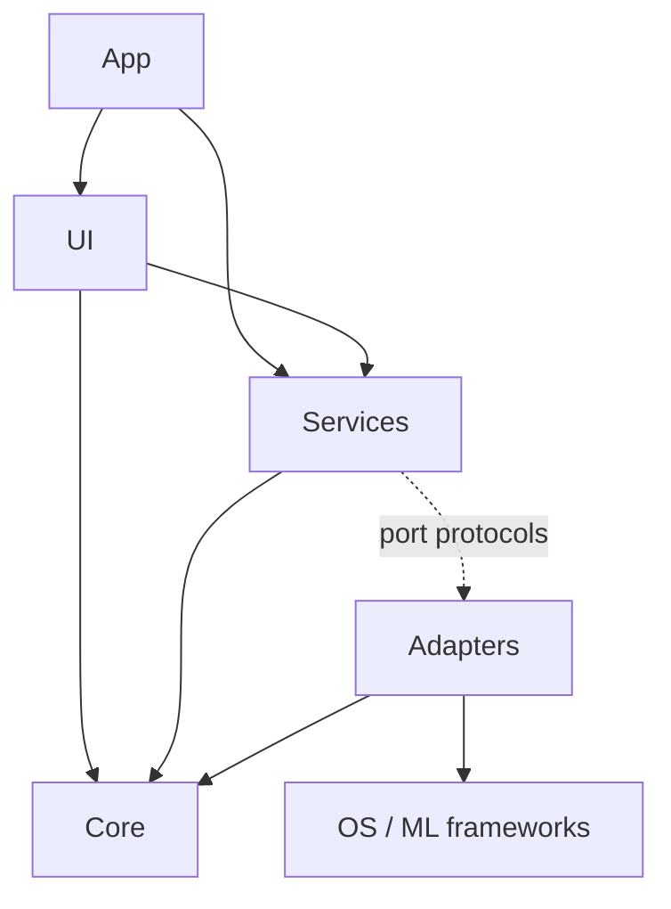
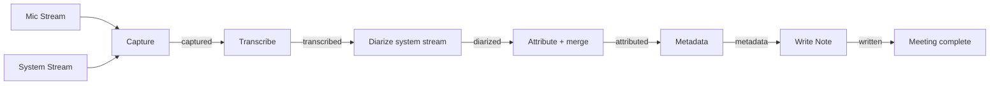
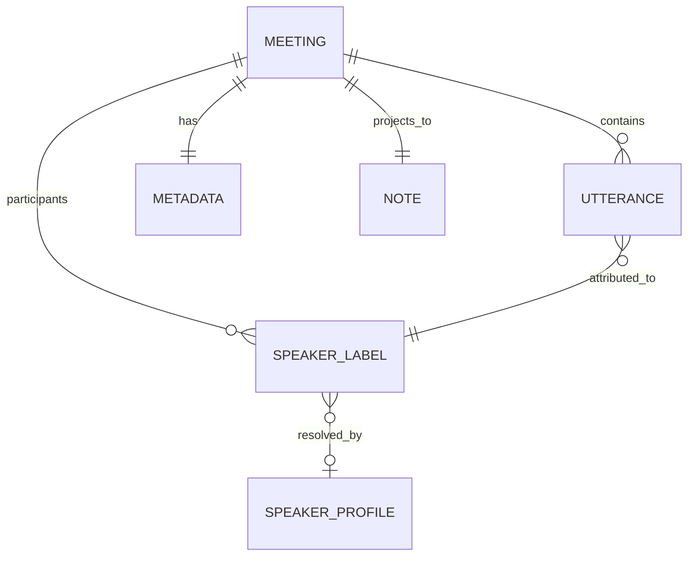

# Architecture Spine — Minutes

Four spikes were run before this spine was written; each committed decision below that touches an OS or ML boundary was verified by running code on the target machine, not asserted. Findings are in `.memlog.md`.

## Design Paradigm

**Layered ports-and-adapters, with a staged resumable pipeline for post-processing.**

| Layer | Namespace | May import |
|---|---|---|
| **Core** — domain types and pure logic | `Sources/Minutes/Core` | `Foundation` only |
| **Services** — orchestration, state, policy | `Sources/Minutes/Services` | Core, port protocols |
| **Adapters** — one per OS/ML boundary | `Sources/Minutes/Adapters/*` | Core, its own framework |
| **UI** — SwiftUI views | `Sources/Minutes/UI` | Core, Services |
| **App** — entry point, scenes | `Sources/Minutes/App` | all |

Every OS and ML dependency (CoreAudio, WhisperKit, SpeakerKit, FoundationModels, UserNotifications, FileManager) sits behind a port protocol defined in Services and implemented in exactly one adapter. This is what makes the Heuristic Backend testable without Apple Intelligence, and the pipeline testable without audio hardware.



Arrows are the only permitted dependency directions. Notably: **no adapter may import another adapter**, and **Core imports nothing but Foundation**.

## Invariants & Rules

### AD-1 — CoreAudio tap IO uses a C-function-pointer IOProc

- **Binds:** FR-6, FR-8, FR-47, the System Stream adapter
- **Prevents:** an implementer reaching for the ergonomic block-based API and shipping a process that hangs on first record with no error and no crash log
- **Rule:** Use `AudioDeviceCreateIOProcID` with a C function pointer and an `Unmanaged<Self>` refCon for context. **Never** `AudioDeviceCreateIOProcIDWithBlock`. *(Verified: the block variant deadlocks indefinitely on a tap-backed aggregate device on macOS 26.6, on both main and background threads. The C variant captured 117,600 frames at peak 0.359 on the first attempt.)*

### AD-2 — Fixed CoreAudio construction and teardown order, on every path

- **Binds:** FR-6, FR-8, FR-9, NFR-5
- **Prevents:** leaked aggregate devices and taps that persist system-wide after a crash, and zero-sample captures from a malformed aggregate
- **Rule:** Construct: tap → default-output UID → private aggregate (real output as `kAudioAggregateDeviceMainSubDeviceKey`, tap in `kAudioAggregateDeviceTapListKey`, `kAudioAggregateDeviceTapAutoStartKey: true`) → IOProc → start. Tear down in exactly the reverse: `AudioDeviceStop` → `AudioDeviceDestroyIOProcID` → `AudioHardwareDestroyAggregateDevice` → `AudioHardwareDestroyProcessTap`. Teardown runs in a `defer`/error path too, never only on the happy path. `CATapDescription.isExclusive` is never mutated after `init(stereoGlobalTapButExcludeProcesses:)`.

### AD-3 — Query the tap's audio format; never assume it

- **Binds:** FR-6, FR-47
- **Prevents:** two adapters disagreeing on sample rate or channel layout and silently producing garbage or half-length audio
- **Rule:** Read `kAudioTapPropertyFormat` after tap creation and drive all downstream buffer handling from it. Handle interleaved, non-interleaved and mono layouts by inspecting the `AudioBufferList`, via `UnsafeMutableAudioBufferListPointer` — never by indexing past `mBuffers.0`. *(Measured on this host: 48 kHz, 2 ch, Float32, flags 9 = IsFloat|IsPacked.)*

### AD-4 — One session clock; all times are offsets from it

- **Binds:** FR-6, FR-23, FR-29, FR-33
- **Prevents:** the two Streams being timestamped from different clocks, which makes the merged Transcript subtly and unfixably out of order
- **Rule:** A Session captures one monotonic start reference at Capture start. Every Utterance, segment and diarization boundary is a `TimeInterval` offset in seconds from that reference. No wall-clock timestamps below the Meeting level, and no per-Stream clocks.

### AD-5 — Detection matches Watched Apps by bundle-ID prefix, and polls

- **Binds:** FR-11, FR-12, FR-15, FR-43
- **Prevents:** shipping detection that never fires for Teams, and detection that misses events because a listener did not
- **Rule:** Enumerate `kAudioHardwarePropertyProcessObjectList` and match a Watched App by **bundle-ID prefix**. A timer poll (≈2 s) is the source of truth; property listeners may only shorten latency and may never be the sole signal. *(Verified: Teams exposes no bare `com.microsoft.teams2` audio object — only `.modulehost`, `.helper`, `.notificationcenter`. Exact matching detects Teams never.)*

### AD-6 — Detection reads metadata only, never audio

- **Binds:** FR-10, NFR-1, PRD §9.1
- **Prevents:** the product's central privacy claim being quietly broken by a future convenience
- **Rule:** While Idle, the app holds no audio device open and reads no audio data. Detection may read only process/device *properties*. Any change that reads audio content outside a Session is a breach of the product premise, not a feature.

### AD-7 — One owner of application state; mutation only through intents

- **Binds:** all UI, FR-3, FR-4, FR-13, FR-24
- **Prevents:** the menu bar, the window and the pipeline each holding their own idea of whether a Session is running
- **Rule:** Exactly one `@MainActor @Observable AppState` holds observable app state. Views never mutate it directly; they call intent methods on `SessionCoordinator`, which is the sole writer. Adapters never touch `AppState` — they return values or publish events upward.

### AD-8 — The Session pipeline is staged, and each stage persists before the next begins

- **Binds:** FR-9, FR-16, FR-19, FR-20, FR-22, FR-26, FR-31, FR-39, NFR-5
- **Prevents:** a late failure discarding expensive upstream work, and two components disagreeing on how far a Meeting got
- **Rule:** Post-Capture processing is an ordered pipeline: `captured → transcribed → diarized → attributed → metadata → written`. Each stage writes its output into the Meeting's own directory and advances a single persisted `stage` field before the next stage runs. A stage failure leaves the Meeting at the last completed stage with a recorded reason, and is resumable from there. No stage may be skipped or reordered.

### AD-9 — The Meeting directory is the source of truth; the Note is a projection

- **Binds:** FR-24, FR-31, FR-35, FR-36, FR-40, NFR-8
- **Prevents:** two owners of Meeting data — the classic failure where editing the Markdown and editing in-app diverge
- **Rule:** Each Meeting owns one directory under Application Support, named by a sortable ID. It holds the audio, a `meeting.json` record, and stage outputs. The Note in the Notes Folder is **generated from** that record and may be regenerated at any time. The app never parses a Note back into state. Consequence: a user editing a Note by hand will have those edits overwritten if the Meeting is edited in-app, and this must be stated in the UI.

### AD-10 — Atomic writes for anything the user can lose

- **Binds:** FR-31, FR-34, FR-35, NFR-5, NFR-8
- **Prevents:** a truncated Note or a corrupt `meeting.json` after a crash or a full disk
- **Rule:** Write to a temporary file in the destination directory, `fsync`, then atomically replace. Applies to Notes, `meeting.json`, and Speaker Profiles. Never write in place.

### AD-11 — Where a voice was is structural; who it is may be inferred

*Amended 2026-08-31 after a user correction: "My microphone is not always me. I might have the mic but be in a meeting room with others." The original rule assigned every Mic Stream Utterance to the Local Speaker without inference, which in a conference room attributes colleagues' words to the user — strictly worse than an anonymous label.*

- **Binds:** FR-21, FR-22, FR-23, FR-25
- **Prevents:** a future refactor that diarizes a mixed stream and loses the room/far-end distinction; and the original rule's failure mode of asserting an identity the audio does not support
- **Rule:** The **place** of a voice is never inferred: a Mic Stream Utterance is always an in-room voice and a System Stream Utterance is always a remote voice, and neither may ever be relabelled across that boundary. **Identity** is separate. Diarization runs on **both** streams. If the Mic Stream yields exactly one voice it is the Local Speaker, and that inference is safe. If it yields more than one, each becomes an anonymous in-room label and **no voice may be claimed as the Local Speaker** — the user names themselves once, and `SpeakerDirectory` remembers the voice thereafter. Every Utterance carries its origin stream so the distinction survives into the data and the UI (`components.speaker-chip` in DESIGN.md renders the three places distinctly).

### AD-12 — Metadata is a port with several implementations; the deterministic one is the floor

- **Binds:** FR-26, FR-27, FR-28, FR-29, FR-30, FR-55, FR-56, FR-61
- **Prevents:** an LLM-only design that cannot title a meeting on the machine it was built for, and untestable metadata
- **Rule:** `MetadataBackend` is a protocol. `HeuristicBackend` is pure, deterministic, dependency-free, and always available — it is the floor and the unit-test target. Every other implementation is selected only after a run-time availability check, must produce a typed structure rather than parsed free text, and every Meeting records which backend ran.
- **Amended (increment 3):** the port now has four implementations, not two — `Heuristic`, `FoundationModels`, `LocalLLM`, `Remote`. Two consequences follow, and they are the whole reason the amendment is worth writing down rather than treating as more of the same:
  1. **The floor is no longer a summariser.** `HeuristicBackend` produces a title and tags and *not* a summary (FR-55), so the port splits into `MetadataBackend` (all four) and `Summarizing` (the other three). "Is a summary possible" becomes a type-level question rather than a runtime guess.
  2. **Availability is no longer a Bool.** With one optional backend, `isAvailable() -> Bool` was sufficient. With three it must carry a reason and a remedy, because FR-58 requires an unavailable backend to explain itself. See AD-22.

### AD-13 — Model identifiers are never hardcoded

- **Binds:** FR-17, FR-18, FR-56
- **Prevents:** a stale model list that silently offers identifiers the library no longer serves
- **Rule:** The model catalogue is obtained from the library at run time (`recommendedModels()` locally, `fetchAvailableModels()` when online). Only the *default* identifier is a constant. *(Verified: real identifiers are `openai_whisper-`-prefixed; the published docs list bare names and is wrong.)*
- **Extended (increment 3):** the same rule binds the summarisation model list. The spike found `Qwen3.5`, `Qwen3.6` and `Qwen3.8` conversions all live on `mlx-community` — a list written from memory would have been wrong on the day it was written. `LLMModelFactory.shared.modelRegistry` is the run-time source, with curation applied on top of it rather than in place of it.

### AD-14 — Serial ML execution

- **Binds:** FR-16, FR-20, FR-22, NFR-4
- **Prevents:** two CoreML models loading at once and putting a 24 GB machine under memory pressure mid-meeting
- **Rule:** All transcription and diarization runs on a single serial executor. A Session may be recorded while another Meeting processes, but two model inferences never run concurrently. Models are loaded lazily and released when the queue drains.

### AD-15 — Swift 5 language mode for the app target `[ADOPTED]`

- **Binds:** the whole build
- **Prevents:** a same-day build drowning in Sendable/isolation diagnostics originating from a dependency that is not Swift-6-ready
- **Rule:** `swiftSettings: [.swiftLanguageMode(.v5)]` on the app target. *(argmax-oss-swift declares `swiftLanguageVersions: [.v5]`.)* Concurrency discipline is still enforced by hand: `@MainActor` for UI and `AppState`, an actor for the capture engine, a serial executor for ML.

### AD-16 — The build produces an ad-hoc signed .app bundle from SPM, with no Xcode project

- **Binds:** the whole build, FR-1, FR-41, FR-42, PRD §12
- **Prevents:** an unsigned or bundle-less binary, which cannot receive TCC consent, cannot post notifications, and cannot own a menu bar item
- **Rule:** `swift build` produces the executable; a checked-in script assembles `Minutes.app` with the Info.plist and ad-hoc signs it with `--options runtime` and the entitlements file. Signing is part of the build, never a manual afterthought. Required Info.plist keys: `LSUIElement`, `CFBundleIdentifier`, `NSMicrophoneUsageDescription`, `NSAudioCaptureUsageDescription`. App Sandbox off, Hardened Runtime on. *(Verified end to end: bundle signs as adhoc+runtime and captured system audio successfully.)*

### AD-17 — Failure is surfaced and never silently swallowed

- **Binds:** NFR-5, FR-7, FR-19, FR-22, FR-27, FR-47
- **Prevents:** the app's worst possible behaviour — appearing to record and producing nothing
- **Rule:** Every adapter returns a typed error; no `try?` that discards a user-visible failure. Each of the three degradations (no System Stream, no diarization, no LLM backend) has an explicit representation on the Meeting record and a defined UI treatment. A degradation is recorded even when it is the expected path.

### AD-18 — The Note filename is derived once and stored on the Meeting record

- **Binds:** FR-31, FR-35, AD-9
- **Prevents:** two components each deriving a filename from the title and producing two Notes for one Meeting — the concrete failure AD-9 leaves open, because AD-9 fixes ownership of *state* but not of the *filename*
- **Rule:** `NoteWriter` is the only component that computes a Note filename. It derives it once at first write and persists it on the Meeting record. On a title change the stored filename is authoritative: `NoteWriter` renames the existing file and updates the record in the same operation. No other component may infer a Note path from a title.

### AD-19 — Utterances reference a stable Speaker Label ID, never a display name

- **Binds:** FR-21, FR-23, FR-24, FR-25
- **Prevents:** rename becoming a rewrite of every Utterance, and label-merge being ambiguous — two compliant implementations could store raw name strings and make FR-24's merge behaviour undefined
- **Rule:** An `Utterance` carries a `SpeakerLabelID` (stable, assigned at attribution). Display names live in one per-Meeting `[SpeakerLabelID: String]` map on the Meeting record. Renaming edits the map only. Renaming two IDs to the same string is precisely what FR-24's merge means, and requires no Utterance mutation.

### AD-20 — Only the Pipeline advances `stage`; stages return values

- **Binds:** AD-8, FR-19, FR-20, FR-39
- **Prevents:** a stage advancing past itself, two stages double-advancing, or a partial advance on failure
- **Rule:** A pipeline stage is a function from inputs to an output value. It never writes the Meeting record and never touches `stage`. The `Pipeline` persists a stage's output and advances `stage` only after that stage returns successfully. Failure leaves `stage` untouched and records a reason alongside it.

### AD-21 — `MeetingStore` is the sole writer of the Meeting record

- **Binds:** AD-8, AD-9, AD-10, AD-17
- **Prevents:** read-modify-write clobbering — Capture writing `systemStreamCaptured`, Diarize writing `diarizationFailed` and Metadata writing `backend` can each silently drop the others' fields if adapters persist the whole record
- **Rule:** Adapters never write `meeting.json`. They return typed results. `MeetingStore` performs all reads and writes, applies field-level updates, and is the only holder of the atomic-write path (AD-10). One serial access point per Meeting.

### AD-22 — Capability is a value with a reason and a remedy, never a Bool

- **Binds:** FR-56, FR-57, FR-58
- **Prevents:** the failure that produced this increment — the app knowing exactly why it could not summarise and having nowhere to put that knowledge
- **Rule:** A backend reports `Capability`, not `Bool`: `.ready`, `.needsDownload(bytes:)`, `.needsKey`, or `.blocked(reason:remedy:)`. `remedy` is structured enough to render as a command where the remedy *is* a command. Every UI state in EXPERIENCE.md's readiness table maps to exactly one case, and a `.blocked` backend is never selectable. Capability is computed on demand, never cached across a pane appearance, so a prerequisite fixed outside the app is picked up without a relaunch.

### AD-23 — Backend precedence is a pure function, evaluated in one place

- **Binds:** FR-52, FR-57
- **Prevents:** two settings that can silently disagree, and an ordering that lives only in whichever branch was written first
- **Rule:** One function maps `(user selection, capabilities) → (backend to run, why)`. It is pure, unit-tested against every combination, and is the only code that decides. The order is: explicit user selection if `.ready`; else the first `.ready` backend in a fixed preference order; else no summariser. The UI displays *what this function returns*, which is why the pane can state which backend will run for the next Meeting rather than only which is selected.

### AD-24 — Egress is a single chokepoint, and audio never reaches it

- **Binds:** FR-59, NFR-1, NFR-6
- **Prevents:** the amended NFR-1 decaying into "some code somewhere makes requests", and any future path that transmits more than was agreed
- **Rule:** Exactly one type in the app may open a network connection for summarisation. It accepts Transcript text and nothing else — its input type cannot express audio, a file URL, or a Speaker Profile, so "audio never leaves" is enforced by the signature rather than by review. It refuses to send without both a stored key and a consent token for that specific Meeting. It is the only place the key is read, and the key is read from the Keychain at the moment of use and never held. NFR-6 stays verifiable because there is exactly one place to look.

### AD-25 — Model storage and download are one mechanism for both kinds of model

- **Binds:** FR-18, FR-56, FR-60
- **Prevents:** a second downloader with its own directory layout, its own progress reporting and its own partial-file bug
- **Rule:** `ModelStorage` owns the download root for transcription *and* summarisation models, in sibling directories under one base. The spike verified `HubApi(downloadBase:)` honours an explicit root, so this is a configuration choice rather than a fight with the library. A failed or cancelled download leaves no partial model that could later load as valid — the rule already in force for transcription models, restated because the failure mode is identical and the code is new.

### AD-26 — Summarisation memory is bounded by unloading transcription first

- **Binds:** NFR-4, FR-61
- **Prevents:** a 24 GB machine under memory pressure holding a Whisper model and a 6 GB language model at once
- **Rule:** AD-14's serial ML execution extends to summarisation: the transcription model is unloaded before a summarisation model loads, and the two are never resident together. Because summarisation runs after transcription in AD-8's stage order this is achievable, but it is an explicit sequencing requirement and not a happy accident. A long Transcript's KV cache growth is bounded by the same chunk-and-combine contract FR-27 already defines, applied regardless of which backend is running.

### AD-27 — The Metal toolchain is a detected prerequisite, not an assumption `[ADOPTED]`

- **Binds:** FR-58
- **Prevents:** offering a multi-gigabyte download on a machine that cannot execute a single token of the result
- **Rule:** MLX requires a compiled `metallib`, which `mlx-swift` builds at build time from `mlx-generated` sources — it ships no prebuilt one. The `LocalLLM` backend therefore reports `.blocked` unless the metallib is present, checked before any download is offered. Two consequences bind the build as well as the app: the build script must copy SPM resource bundles into `Minutes.app/Contents/Resources/`, which AD-16's current script does not do; and the developer machine needs `xcodebuild -downloadComponent MetalToolchain`, which is *currently uninstalled* here. Marked `[ADOPTED]` because it is a measured property of the toolchain, not a choice.

## Consistency Conventions

| Concern | Convention |
| --- | --- |
| Naming — types | PRD Glossary terms verbatim as type names: `Meeting`, `Session`, `Utterance`, `SpeakerLabel`, `SpeakerProfile`, `TranscriptionModel`, `MetadataBackend`, `Note`. No synonyms — no `Recording`, no `Segment` for an Utterance. |
| Naming — ports vs adapters | Port protocol `Xxxing` or `XxxPort` in Services; adapter `ConcreteXxx` in `Adapters/`. E.g. `Transcribing` ← `WhisperKitTranscriber`. |
| Naming — files | One primary type per file, filename == type name. |
| IDs | Meeting ID is a sortable string `yyyyMMdd-HHmmss-<4 random chars>`; it is the directory name and never changes, including on rename. |
| Dates & times | Wall-clock as ISO 8601 with offset, at Meeting level only. Everything below is `TimeInterval` seconds from the session clock (AD-4). |
| Durations in UI | Monospaced digits, `mm:ss` under an hour, `h:mm:ss` over. |
| Errors | One `MinutesError` enum per adapter domain, each case carrying a user-presentable reason. No `NSError`, no string-typed errors. |
| Logging | `os.Logger` with subsystem `dev.niklas.minutes` and one category per layer. Every CoreAudio call's `OSStatus` is logged at the boundary — the spikes proved this is how a silent failure gets found. Never log transcript text. |
| Config / preferences | `UserDefaults` for scalars; the Notes Folder as a security-scoped bookmark, not a path string. |
| Security-scoped access | `Preferences` resolves the Notes Folder bookmark and owns the single balanced `startAccessingSecurityScopedResource` / `stop…` pair. No other component starts or stops access. |
| Meeting record writes | Field-level updates through `MeetingStore` only (AD-21). Adapters return values. |
| State mutation | Only `SessionCoordinator` writes `AppState` (AD-7). |
| Concurrency | `@MainActor`: UI, `AppState`, `SessionCoordinator`. `actor`: capture engine. Serial executor: ML (AD-14). IOProc: C callback, real-time-safe — no allocation, no locks, no logging inside it. |
| Persistence format | `meeting.json` via `Codable` with explicit `CodingKeys`; unknown-key tolerant on read so an older record still loads. |
| Visual tokens | Never hardcode a colour or metric present in `DESIGN.md`; resolve semantic colours from AppKit at render time. |

## Stack

Verified on the target machine on 2026-08-31.

| Name | Version |
| --- | --- |
| macOS (target / host) | deployment 15.0 · host 26.6.2 (25G83) |
| Swift toolchain | 6.3.3 (language mode 5 — AD-15) |
| swift-tools-version | 6.0 |
| Xcode CLI tools | 26.6 (17F113) |
| argmaxinc/argmax-oss-swift | exact 1.1.0 (products `WhisperKit`, `SpeakerKit`) |
| Default Transcription Model | `openai_whisper-large-v3-v20240930_turbo_632MB` |
| Diarization models | pyannote v4 community-1 via `argmaxinc/speakerkit-coreml` (lazy, first `diarize()`) |
| UI | SwiftUI (`MenuBarExtra`, `NavigationSplitView`) |
| Apple on-device LLM (optional) | `FoundationModels` — run-time availability check. **Verified unavailable on this host:** `appleIntelligenceNotEnabled`, i.e. eligible hardware with the feature declined at Setup Assistant |
| Local downloadable LLM (increment 3) | `ml-explore/mlx-swift-examples` exact `2.29.1` (products `MLXLLM`, `MLXLMCommon`) → `mlx-swift` `0.31.6`. Adds `swift-transformers` 1.0.x and `GzipSwift` 6.0.1 transitively; no conflict with the argmax graph, which vendors its own dependencies |
| Metal toolchain | **required by the above and currently `uninstalled`** — `xcodebuild -downloadComponent MetalToolchain`. See AD-27 |
| Candidate summarisation models | sizes fetched live, not estimated: `Qwen3.5-4B-MLX-4bit` 3.03 GB · `Llama-3.1-8B-Instruct-4bit` 4.52 GB · `Qwen3.5-9B-MLX-4bit` 5.95 GB. Curation pending PRD §13 Q13 |
| Build/packaging | `swift build` + `Scripts/build-app.sh` (assemble + ad-hoc `codesign`) |

## Structural Seed

### Processing pipeline (AD-8)



Each edge label is the persisted `stage` value reached. Any stage may fail and be resumed from the previous label.

### Core entities



`NOTE` is a projection, not stored state (AD-9). `SPEAKER_PROFILE` is app-global, not per-Meeting.

### Source tree

```text
Minutes/
  Package.swift
  Scripts/
    build-app.sh          # swift build -> assemble Minutes.app -> ad-hoc codesign (AD-16)
    Info.plist            # LSUIElement, usage descriptions, bundle id
    Minutes.entitlements  # sandbox off, audio-input on
  Sources/Minutes/
    App/                  # @main entry, MenuBarExtra scene, window scene
    Core/                 # Meeting, Utterance, SpeakerLabel, Stage, errors — Foundation only
    Services/
      SessionCoordinator  # sole writer of AppState (AD-7); starts/stops Sessions
      Pipeline            # staged processing (AD-8)
      DetectionService    # poll + prefix match (AD-5)
      ModelCatalog        # runtime model list (AD-13)
      SpeakerDirectory    # SpeakerProfile matching (FR-25)
      Ports/              # protocols: Capturing, Transcribing, Diarizing, MetadataBackend, NoteWriting
    Adapters/
      Audio/              # MicCapture, SystemTapCapture (AD-1..3), StreamFileWriter
      Transcribe/         # WhisperKitTranscriber
      Diarize/            # SpeakerKitDiarizer
      Metadata/           # HeuristicBackend (pure), FoundationModelsBackend
      Persistence/        # MeetingStore, NoteWriter, Preferences
      System/             # Notifier, LoginItem, Permissions
    UI/                   # MenuBarContent, GettingStartedPane, TranscriptionPane,
                          # DetectionPane, GeneralPane, MeetingsPane, components/
  Tests/MinutesTests/     # Heuristic backend, merge/attribution, Note rendering, stage machine
```

## Capability → Architecture Map

| Capability / Area | Lives in | Governed by |
| --- | --- | --- |
| Menu bar control (FR-1…5) | `App/`, `UI/MenuBarContent` | AD-7, DESIGN.md components.menubar-icon |
| Dual-stream capture (FR-6…10) | `Adapters/Audio` | AD-1, AD-2, AD-3, AD-4, AD-6 |
| Detection + prompt (FR-11…15) | `Services/DetectionService`, `Adapters/System/Notifier` | AD-5, AD-6 |
| Transcription + models (FR-16…20) | `Adapters/Transcribe`, `Services/ModelCatalog` | AD-13, AD-14, AD-8 |
| Speaker attribution (FR-21…25) | `Adapters/Diarize`, `Services/SpeakerDirectory` | AD-11, AD-4 |
| Metadata (FR-26…30) | `Adapters/Metadata` | AD-12, AD-17 |
| Note output (FR-31…35) | `Adapters/Persistence/NoteWriter` | AD-9, AD-10 |
| Library (FR-36…40) | `UI/MeetingsPane`, `Adapters/Persistence/MeetingStore` | AD-9, AD-8 |
| Setup / settings (FR-41…48) | `UI/GettingStartedPane` + panes | AD-16, EXPERIENCE.md § Permission Choreography |
| Library management (FR-49…54) | `UI/MeetingsPane`, `UI/GeneralPane`, `Services/AppState` | AD-9, AD-8, AD-21 |
| Summarisation intelligence (FR-55…61) | `Adapters/Metadata/*`, `Services/SummarizerCatalog`, `Adapters/System/KeyStore`, `UI/SummariesPane` | AD-12, AD-22, AD-23, AD-24, AD-25, AD-26, AD-27 |

## Deferred

- **Live/streaming transcription.** PRD §6.2 defers it to v2. AD-8's staged pipeline is deliberately batch-shaped; streaming would need a different decomposition, and pre-building for it would compromise the reliable path.
- **Crash-recovery UI.** AD-8 makes an interrupted Meeting resumable and AD-10 keeps its data intact, so recovery is a UI affordance, not an architectural gap. Deferred per PRD §6.2.
- **Speaker Profile matching algorithm.** AD-11 fixes *where* it lives and that Remote-only diarization feeds it; the embedding/threshold choice is a story-level decision pending PRD §13 Q4. If it proves unreliable the port stays and the implementation degrades to manual rename.
- **Aggregate device rebuild on output-device change.** FR-8 requires surviving the change; whether that means rebuilding the aggregate or the HAL handling it is unresolved (PRD §13 Q7). AD-2 fixes the ordering either way, so this is a story-level experiment.
- **Notes Folder conflict policy for hand-edited Notes.** AD-9 makes the Note a projection and requires the UI to say so; a merge or conflict-detection strategy is out of scope for v1.
- **Distribution, notarization, auto-update.** Excluded by PRD §5. AD-16 stops at a locally installed ad-hoc signed bundle.
- **Model eviction policy.** FR-44 exposes disk use and removal; an automatic policy is deferred — the user decides.
- **Global hotkey.** EXPERIENCE.md defers it to v2; it would add a permission surface and a conflict UI.
- **Which local model, and whether a 4-bit model in the 3-6 GB class is good enough at all.** AD-12 fixes the port and AD-13 fixes where the list comes from; the curation is a story-level decision that cannot be made before PRD §13 Q13 is measured — and it cannot be measured until AD-27's prerequisite is installed. This is the increment's critical path.
- **Which remote endpoint, and whether the remote backend should ship.** AD-24 fixes the chokepoint and its contract, so the shape is settled whatever the answer. Whether to build it depends on the local path's measured quality and on whether an employer-approved vendor under a data processing agreement exists (PRD §13 Q17). The architecture is deliberately indifferent to the answer.
- **Streaming summarisation output.** The spike confirmed the local path returns an `AsyncStream` of chunks, so partial output is available. Whether the UI shows a summary assembling itself is a UX decision with no architectural consequence — the port returns a completed structure either way (AD-12's typed-output rule).
- **Prompt design and its versioning.** Summary quality will depend heavily on the prompt, and a changed prompt changes output for the same Transcript. Whether the prompt version belongs in the Note's provenance alongside the model identifier is deferred until there is a prompt worth versioning.
