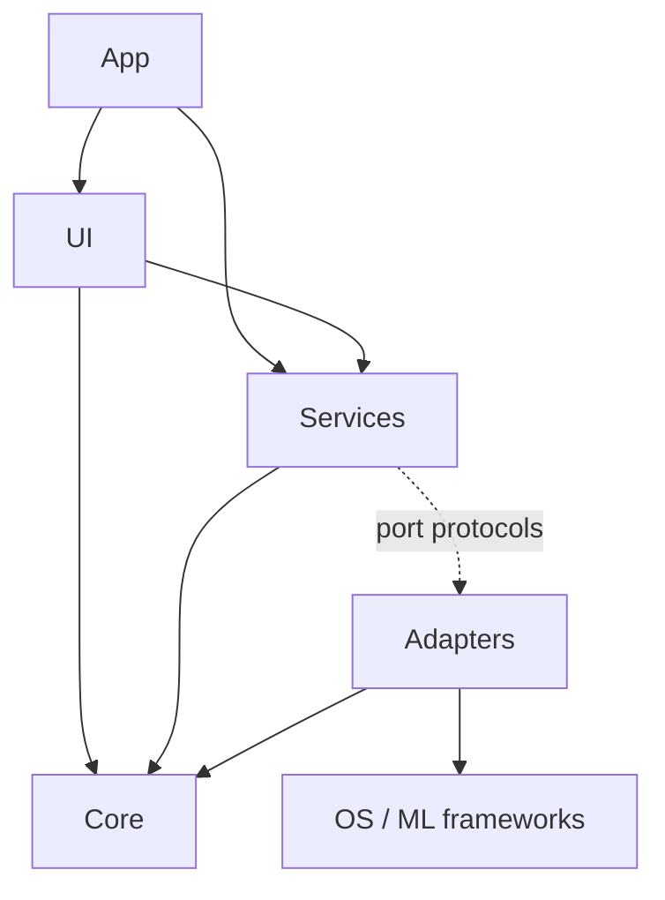
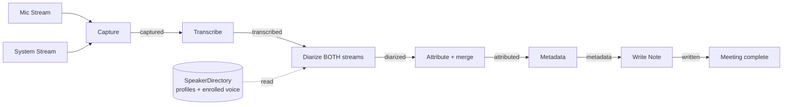
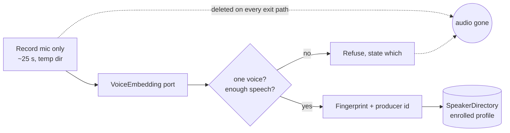
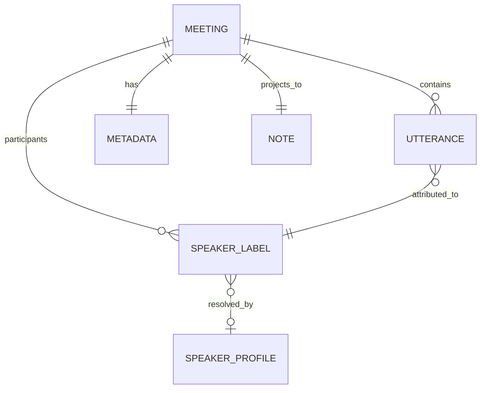

# Architecture Spine — Minutes

Four spikes were run before this spine was written; each committed decision below that touches an OS or ML boundary was verified by running code on the target machine, not asserted. Findings are in `.memlog.md`.

AD-33 … AD-38 (2026-09-02) come from a different kind of investigation: the first audit of the code against a machine other than the one it was written on, plus current Apple and Homebrew documentation on what it takes to install an app somewhere else. Two of those decisions are forced by mechanism rather than chosen — see AD-34's recorded note.

Two further measurement runs (2026-09-01) inform AD-11 and AD-28 … AD-32: a spike on isolating the user's voice from a conversation happening beside them, and a calibration of the speaker-matching threshold against the centroids of five real Meetings. The threshold is the first number in this spine that was *measured* rather than chosen.

## Design Paradigm

**Layered ports-and-adapters, with a staged resumable pipeline for post-processing.**

| Layer | Namespace | May import |
|---|---|---|
| **Core** — domain types and pure logic | `Sources/Minutes/Core` | `Foundation` only |
| **Services** — orchestration, state, policy | `Sources/Minutes/Services` | Core, port protocols |
| **Adapters** — one per OS/ML boundary | `Sources/Minutes/Adapters/*` | Core, its own framework |
| **UI** — SwiftUI views | `Sources/Minutes/UI` | Core, Services |
| **App** — entry point, scenes | `Sources/Minutes/App` | all |

Every OS and ML dependency (CoreAudio, WhisperKit, SpeakerKit, FoundationModels, UserNotifications, FileManager) sits behind a port protocol defined in Services and implemented in exactly one adapter. This is what makes the Heuristic Backend testable without Apple Intelligence, and the pipeline testable without audio hardware.



Arrows are the only permitted dependency directions. Notably: **no adapter may import another adapter**, and **Core imports nothing but Foundation**.

## Invariants & Rules

### AD-1 — CoreAudio tap IO uses a C-function-pointer IOProc

- **Binds:** FR-6, FR-8, FR-47, the System Stream adapter
- **Prevents:** an implementer reaching for the ergonomic block-based API and shipping a process that hangs on first record with no error and no crash log
- **Rule:** Use `AudioDeviceCreateIOProcID` with a C function pointer and an `Unmanaged<Self>` refCon for context. **Never** `AudioDeviceCreateIOProcIDWithBlock`. *(Verified: the block variant deadlocks indefinitely on a tap-backed aggregate device on macOS 26.6, on both main and background threads. The C variant captured 117,600 frames at peak 0.359 on the first attempt.)*

### AD-2 — Fixed CoreAudio construction and teardown order, on every path

- **Binds:** FR-6, FR-8, FR-9, NFR-5
- **Prevents:** leaked aggregate devices and taps that persist system-wide after a crash, and zero-sample captures from a malformed aggregate
- **Rule:** Construct: tap → default-output UID → private aggregate (real output as `kAudioAggregateDeviceMainSubDeviceKey`, tap in `kAudioAggregateDeviceTapListKey`, `kAudioAggregateDeviceTapAutoStartKey: true`) → IOProc → start. Tear down in exactly the reverse: `AudioDeviceStop` → `AudioDeviceDestroyIOProcID` → `AudioHardwareDestroyAggregateDevice` → `AudioHardwareDestroyProcessTap`. Teardown runs in a `defer`/error path too, never only on the happy path. `CATapDescription.isExclusive` is never mutated after `init(stereoGlobalTapButExcludeProcesses:)`.

### AD-3 — Query the tap's audio format; never assume it

- **Binds:** FR-6, FR-47
- **Prevents:** two adapters disagreeing on sample rate or channel layout and silently producing garbage or half-length audio
- **Rule:** Read `kAudioTapPropertyFormat` after tap creation and drive all downstream buffer handling from it. Handle interleaved, non-interleaved and mono layouts by inspecting the `AudioBufferList`, via `UnsafeMutableAudioBufferListPointer` — never by indexing past `mBuffers.0`. *(Measured on this host: 48 kHz, 2 ch, Float32, flags 9 = IsFloat|IsPacked.)*

*Amended 2026-09-03, after the failure named in this AD's own Prevents clause happened anyway.*

**Querying the format is necessary and is not sufficient.** This rule was followed exactly — the format is read from the tap, never assumed — and seven of sixteen recordings still came out at two or three times speed, because a rate read **once, at tap creation** is a claim about that instant and not about what the device goes on to deliver. Selecting a Bluetooth headset as the *input* device moves the shared clock, and the tap then delivers at a rate the app already believes it knows.

The rule therefore gains a second half: a declared rate is a starting hypothesis, and it must be **checked against the session clock while recording** (AD-44). "Never assume it" now means never assume it *stays true* either.

*Amended 2026-09-03 (increment 9): "the session clock" was the wrong clock.* AD-44 measured frames against `Date()`, which is why it needed a 12% tolerance and a three-second settling window — both of them absorbing scheduling jitter rather than measuring audio. The device supplies its own sample-time and host-time counters in every IOProc callback and Minutes discarded them. The check now uses the **audio clock** (AD-51), and the tolerances that existed to hide wall-clock noise go with it.

### AD-4 — One session clock; all times are offsets from it

- **Binds:** FR-6, FR-23, FR-29, FR-33
- **Prevents:** the two Streams being timestamped from different clocks, which makes the merged Transcript subtly and unfixably out of order
- **Rule:** A Session captures one monotonic start reference at Capture start. Every Utterance, segment and diarization boundary is a `TimeInterval` offset in seconds from that reference. No wall-clock timestamps below the Meeting level, and no per-Stream clocks.

  *Amended 2026-09-03 (increment 9): the rule was followed and the guarantee did not hold.* One session reference is not the same thing as two files that start together. Measured across the real library, `mic.wav` and `system.wav` differ in length by **−364 ms to +3,278 ms**: the microphone and the system tap begin capturing at different instants, and each file's offsets are relative to its own first sample. So the merged Transcript is ordered by file position, not by time, and can be wrong by seconds — the exact failure this AD's Prevents clause names. Until capture aligns them, the offset is **measured and applied** (FR-97), and an Utterance's position reflects when it was said.

### AD-5 — Detection matches Watched Apps by bundle-ID prefix, and polls

- **Binds:** FR-11, FR-12, FR-15, FR-43
- **Prevents:** shipping detection that never fires for Teams, and detection that misses events because a listener did not
- **Rule:** Enumerate `kAudioHardwarePropertyProcessObjectList` and match a Watched App by **bundle-ID prefix**. A timer poll (≈2 s) is the source of truth; property listeners may only shorten latency and may never be the sole signal. *(Verified: Teams exposes no bare `com.microsoft.teams2` audio object — only `.modulehost`, `.helper`, `.notificationcenter`. Exact matching detects Teams never.)*

### AD-6 — Detection reads metadata only, never audio

- **Binds:** FR-10, NFR-1, PRD §9.1
- **Prevents:** the product's central privacy claim being quietly broken by a future convenience
- **Rule:** While Idle, the app holds no audio device open and reads no audio data. Detection may read only process/device *properties*. Any change that reads audio content outside a Session is a breach of the product premise, not a feature.

### AD-7 — One owner of application state; mutation only through intents

- **Binds:** all UI, FR-3, FR-4, FR-13, FR-24
- **Prevents:** the menu bar, the window and the pipeline each holding their own idea of whether a Session is running
- **Rule:** Exactly one `@MainActor @Observable AppState` holds observable app state. Views never mutate it directly; they call intent methods on `SessionCoordinator`, which is the sole writer. Adapters never touch `AppState` — they return values or publish events upward.

### AD-8 — The Session pipeline is staged, and each stage persists before the next begins

- **Binds:** FR-9, FR-16, FR-19, FR-20, FR-22, FR-26, FR-31, FR-39, NFR-5
- **Prevents:** a late failure discarding expensive upstream work, and two components disagreeing on how far a Meeting got
- **Rule:** Post-Capture processing is an ordered pipeline: `captured → transcribed → diarized → attributed → metadata → written`. Each stage writes its output into the Meeting's own directory and advances a single persisted `stage` field before the next stage runs. A stage failure leaves the Meeting at the last completed stage with a recorded reason, and is resumable from there. No stage may be skipped or reordered.

### AD-9 — The Meeting directory is the source of truth; the Note is a projection

- **Binds:** FR-24, FR-31, FR-35, FR-36, FR-40, NFR-8
- **Prevents:** two owners of Meeting data — the classic failure where editing the Markdown and editing in-app diverge
- **Rule:** Each Meeting owns one directory under Application Support, named by a sortable ID. It holds the audio, a `meeting.json` record, and stage outputs. The Note in the Notes Folder is **generated from** that record and may be regenerated at any time. The app never parses a Note back into state.

*Amended 2026-09-03, after a renamed Note cost a Meeting.* Two clarifications, neither of which relaxes the rule:

1. **Identity is not content.** Reading a Note's frontmatter to learn *which Meeting it is* is permitted and is the mechanism AD-39 depends on. Reading anything else out of a Note — a title, a summary, a transcript line, a speaker name — remains forbidden. The dividing line is mechanical: the identity reader returns a Meeting ID and a start time, and its return type makes a body field unrepresentable.
2. **"Those edits will be overwritten" is no longer the whole consequence.** It was the consequence while the app could not tell its own output from a human's. AD-41 gives it that ability, so the rule becomes: a projection is regenerated freely over the app's own bytes, and never over bytes the app did not write without the user saying so. The original clause's obligation — *and this must be stated in the UI* — stood unmet for six increments; it is now FR-81's job and not a comment's.

### AD-10 — Atomic writes for anything the user can lose

- **Binds:** FR-31, FR-34, FR-35, NFR-5, NFR-8
- **Prevents:** a truncated Note or a corrupt `meeting.json` after a crash or a full disk
- **Rule:** Write to a temporary file in the destination directory, `fsync`, then atomically replace. Applies to Notes, `meeting.json`, and Speaker Profiles. Never write in place.

### AD-11 — Where a voice was is structural; who it is may be inferred

*Amended 2026-08-31 after a user correction: "My microphone is not always me. I might have the mic but be in a meeting room with others." The original rule assigned every Mic Stream Utterance to the Local Speaker without inference, which in a conference room attributes colleagues' words to the user — strictly worse than an anonymous label.*

*Amended again 2026-09-01 (increment 4). The 2026-08-31 rule was right and incomplete: refusing to claim an identity is honest, and it is still not an answer. Identity now has a measured resolution path. **Nothing about place changes**, and the amendment is deliberately narrow — it adds one way for a voice to become the Local Speaker and removes none of the guarantees that hold when it does not fire.*

- **Binds:** FR-21, FR-22, FR-23, FR-25, FR-63
- **Prevents:** a future refactor that diarizes a mixed stream and loses the room/far-end distinction; the original rule's failure mode of asserting an identity the audio does not support; and — after the amendment — the opposite failure of treating an enrolment *measurement* as though it carried the same certainty as the structural fact
- **Rule:** The **place** of a voice is never inferred: a Mic Stream Utterance is always an in-room voice and a System Stream Utterance is always a remote voice, and neither may ever be relabelled across that boundary. **Identity** is separate. Diarization runs on **both** streams.
  - One voice on the Mic Stream **is** the Local Speaker. Structural, and cannot be wrong.
  - Several voices on the Mic Stream, with an Enrolled Voice matching one of them within AD-31's threshold and unambiguously: **that** voice is the Local Speaker. This is a measurement, not a structural fact, and AD-30 governs how it is made and how it is recorded.
  - Several voices on the Mic Stream with no Enrolled Voice, or no unambiguous match: each becomes an anonymous in-room label and **no voice may be claimed as the Local Speaker.** Unchanged.

  *Amended again 2026-09-03 (increment 9).* "A Mic Stream Utterance is always an in-room voice" was the load-bearing half of this rule, and it was **false whenever the user was on speakers**. The far end arrives acoustically through the microphone, so the Mic Stream contains remote voices, and this rule then promoted them to attendees: one real recording produced **six in-room labels** and never identified the user, because their own voice was one polluted cluster among six. The structural claim survives, but only over audio that has passed AD-47: **place is structural for the retained Mic Stream, not for the raw one.**
  - Mic Stream speech no diarized span covers, when several voices share the microphone, is unidentified in-room speech. Never the Local Speaker by default. *(This was a real defect: the default fell through to the Local Speaker and printed 14 utterances of a neighbouring conversation as the user's own words.)*

  Every Utterance carries its origin stream so the distinction survives into the data and the UI (`components.speaker-chip` in DESIGN.md renders the three places distinctly). Enrolment changes **which** in-room voice is the Local Speaker; it never changes the structural rules, and the attribution function's other behaviour is byte-for-byte the same with and without a fingerprint present.

### AD-12 — Metadata is a port with several implementations; the deterministic one is the floor

- **Binds:** FR-26, FR-27, FR-28, FR-29, FR-30, FR-55, FR-56, FR-61
- **Prevents:** an LLM-only design that cannot title a meeting on the machine it was built for, and untestable metadata
- **Rule:** `MetadataBackend` is a protocol. `HeuristicBackend` is pure, deterministic, dependency-free, and always available — it is the floor and the unit-test target. Every other implementation is selected only after a run-time availability check, must produce a typed structure rather than parsed free text, and every Meeting records which backend ran.
- **Amended (increment 3):** the port now has four implementations, not two — `Heuristic`, `FoundationModels`, `LocalLLM`, `Remote`. Two consequences follow, and they are the whole reason the amendment is worth writing down rather than treating as more of the same:
  1. **The floor is no longer a summariser.** `HeuristicBackend` produces a title and tags and *not* a summary (FR-55), so the port splits into `MetadataBackend` (all four) and `Summarizing` (the other three). "Is a summary possible" becomes a type-level question rather than a runtime guess.
  2. **Availability is no longer a Bool.** With one optional backend, `isAvailable() -> Bool` was sufficient. With three it must carry a reason and a remedy, because FR-58 requires an unavailable backend to explain itself. See AD-22.

### AD-13 — Model identifiers are never hardcoded

- **Binds:** FR-17, FR-18, FR-56
- **Prevents:** a stale model list that silently offers identifiers the library no longer serves
- **Rule:** The model catalogue is obtained from the library at run time (`recommendedModels()` locally, `fetchAvailableModels()` when online). Only the *default* identifier is a constant. *(Verified: real identifiers are `openai_whisper-`-prefixed; the published docs list bare names and is wrong.)*
- **Extended (increment 3):** the same rule binds the summarisation model list. The spike found `Qwen3.5`, `Qwen3.6` and `Qwen3.8` conversions all live on `mlx-community` — a list written from memory would have been wrong on the day it was written. `LLMModelFactory.shared.modelRegistry` is the run-time source, with curation applied on top of it rather than in place of it.

### AD-14 — Serial ML execution

- **Binds:** FR-16, FR-20, FR-22, NFR-4
- **Prevents:** two CoreML models loading at once and putting a 24 GB machine under memory pressure mid-meeting
- **Rule:** All transcription and diarization runs on a single serial executor. A Session may be recorded while another Meeting processes, but two model inferences never run concurrently. Models are loaded lazily and released when the queue drains.

### AD-15 — Swift 5 language mode for the app target `[ADOPTED]`

- **Binds:** the whole build
- **Prevents:** a same-day build drowning in Sendable/isolation diagnostics originating from a dependency that is not Swift-6-ready
- **Rule:** `swiftSettings: [.swiftLanguageMode(.v5)]` on the app target. *(argmax-oss-swift declares `swiftLanguageVersions: [.v5]`.)* Concurrency discipline is still enforced by hand: `@MainActor` for UI and `AppState`, an actor for the capture engine, a serial executor for ML.

### AD-16 — The build produces an ad-hoc signed .app bundle from SPM, with no Xcode project

- **Binds:** the whole build, FR-1, FR-41, FR-42, PRD §12
- **Prevents:** an unsigned or bundle-less binary, which cannot receive TCC consent, cannot post notifications, and cannot own a menu bar item
- **Rule:** `swift build` produces the executable; a checked-in script assembles `Minutes.app` with the Info.plist and ad-hoc signs it with `--options runtime` and the entitlements file. Signing is part of the build, never a manual afterthought. Required Info.plist keys: `LSUIElement`, `CFBundleIdentifier`, `NSMicrophoneUsageDescription`, `NSAudioCaptureUsageDescription`. App Sandbox off, Hardened Runtime on. *(Verified end to end: bundle signs as adhoc+runtime and captured system audio successfully.)*

### AD-17 — Failure is surfaced and never silently swallowed

- **Binds:** NFR-5, FR-7, FR-19, FR-22, FR-27, FR-47
- **Prevents:** the app's worst possible behaviour — appearing to record and producing nothing
- **Rule:** Every adapter returns a typed error; no `try?` that discards a user-visible failure. Each of the three degradations (no System Stream, no diarization, no LLM backend) has an explicit representation on the Meeting record and a defined UI treatment. A degradation is recorded even when it is the expected path.

### AD-18 — The Note filename is derived once and stored on the Meeting record

- **Binds:** FR-31, FR-35, AD-9
- **Prevents:** two components each deriving a filename from the title and producing two Notes for one Meeting — the concrete failure AD-9 leaves open, because AD-9 fixes ownership of *state* but not of the *filename*
- **Rule:** `NoteWriter` is the only component that computes a Note filename. It derives it once at first write and persists it on the Meeting record. On a title change the stored filename is authoritative: `NoteWriter` renames the existing file and updates the record in the same operation. No other component may infer a Note path from a title.

*Amended 2026-09-03.* The authority above holds only while the name on disk is still the name the app wrote. The moment they differ the file is **user-named**, and AD-40 inverts the authority: the app follows the file and no component renames it. The derived name never disappears — it stays on the record as the thing the divergence is measured against.

### AD-19 — Utterances reference a stable Speaker Label ID, never a display name

- **Binds:** FR-21, FR-23, FR-24, FR-25
- **Prevents:** rename becoming a rewrite of every Utterance, and label-merge being ambiguous — two compliant implementations could store raw name strings and make FR-24's merge behaviour undefined
- **Rule:** An `Utterance` carries a `SpeakerLabelID` (stable, assigned at attribution). Display names live in one per-Meeting `[SpeakerLabelID: String]` map on the Meeting record. Renaming edits the map only. Renaming two IDs to the same string is precisely what FR-24's merge means, and requires no Utterance mutation.

### AD-20 — Only the Pipeline advances `stage`; stages return values

- **Binds:** AD-8, FR-19, FR-20, FR-39
- **Prevents:** a stage advancing past itself, two stages double-advancing, or a partial advance on failure
- **Rule:** A pipeline stage is a function from inputs to an output value. It never writes the Meeting record and never touches `stage`. The `Pipeline` persists a stage's output and advances `stage` only after that stage returns successfully. Failure leaves `stage` untouched and records a reason alongside it.

### AD-21 — `MeetingStore` is the sole writer of the Meeting record

- **Binds:** AD-8, AD-9, AD-10, AD-17
- **Prevents:** read-modify-write clobbering — Capture writing `systemStreamCaptured`, Diarize writing `diarizationFailed` and Metadata writing `backend` can each silently drop the others' fields if adapters persist the whole record
- **Rule:** Adapters never write `meeting.json`. They return typed results. `MeetingStore` performs all reads and writes, applies field-level updates, and is the only holder of the atomic-write path (AD-10). One serial access point per Meeting.

### AD-22 — Capability is a value with a reason and a remedy, never a Bool

- **Binds:** FR-56, FR-57, FR-58
- **Prevents:** the failure that produced this increment — the app knowing exactly why it could not summarise and having nowhere to put that knowledge
- **Rule:** A backend reports `Capability`, not `Bool`: `.ready`, `.needsDownload(bytes:)`, `.needsKey`, or `.blocked(reason:remedy:)`. `remedy` is structured enough to render as a command where the remedy *is* a command. Every UI state in EXPERIENCE.md's readiness table maps to exactly one case, and a `.blocked` backend is never selectable. Capability is computed on demand, never cached across a pane appearance, so a prerequisite fixed outside the app is picked up without a relaunch.

### AD-23 — Backend precedence is a pure function, evaluated in one place

- **Binds:** FR-52, FR-57
- **Prevents:** two settings that can silently disagree, and an ordering that lives only in whichever branch was written first
- **Rule:** One function maps `(user selection, capabilities) → (backend to run, why)`. It is pure, unit-tested against every combination, and is the only code that decides. The order is: explicit user selection if `.ready`; else the first `.ready` backend in a fixed preference order; else no summariser. The UI displays *what this function returns*, which is why the pane can state which backend will run for the next Meeting rather than only which is selected.

### AD-24 — Egress is a single chokepoint, and audio never reaches it

- **Binds:** FR-59, NFR-1, NFR-6
- **Prevents:** the amended NFR-1 decaying into "some code somewhere makes requests", and any future path that transmits more than was agreed
- **Rule:** Exactly one type in the app may open a network connection for summarisation. It accepts Transcript text and nothing else — its input type cannot express audio, a file URL, or a Speaker Profile, so "audio never leaves" is enforced by the signature rather than by review. It refuses to send without both a stored key and a consent token for that specific Meeting. It is the only place the key is read, and the key is read from the Keychain at the moment of use and never held. NFR-6 stays verifiable because there is exactly one place to look.

### AD-25 — Model storage and download are one mechanism for both kinds of model

- **Binds:** FR-18, FR-56, FR-60
- **Prevents:** a second downloader with its own directory layout, its own progress reporting and its own partial-file bug
- **Rule:** `ModelStorage` owns the download root for transcription *and* summarisation models, in sibling directories under one base. The spike verified `HubApi(downloadBase:)` honours an explicit root, so this is a configuration choice rather than a fight with the library. A failed or cancelled download leaves no partial model that could later load as valid — the rule already in force for transcription models, restated because the failure mode is identical and the code is new.

### AD-26 — Summarisation memory is bounded by unloading transcription first

- **Binds:** NFR-4, FR-61
- **Prevents:** a 24 GB machine under memory pressure holding a Whisper model and a 6 GB language model at once
- **Rule:** AD-14's serial ML execution extends to summarisation: the transcription model is unloaded before a summarisation model loads, and the two are never resident together. Because summarisation runs after transcription in AD-8's stage order this is achievable, but it is an explicit sequencing requirement and not a happy accident. A long Transcript's KV cache growth is bounded by the same chunk-and-combine contract FR-27 already defines, applied regardless of which backend is running.

### AD-27 — The Metal toolchain is a detected prerequisite, not an assumption `[ADOPTED]`

- **Binds:** FR-58
- **Prevents:** offering a multi-gigabyte download on a machine that cannot execute a single token of the result
- **Rule:** MLX requires a compiled `metallib`, which `mlx-swift` builds at build time from `mlx-generated` sources — it ships no prebuilt one. The `LocalLLM` backend therefore reports `.blocked` unless the metallib is present, checked before any download is offered. Two consequences bind the build as well as the app: the build script must copy SPM resource bundles into `Minutes.app/Contents/Resources/`, which AD-16's current script does not do; and the developer machine needs `xcodebuild -downloadComponent MetalToolchain`, which is *currently uninstalled* here. Marked `[ADOPTED]` because it is a measured property of the toolchain, not a choice.

### AD-28 — Voice identity is a port over a fixed-length embedding, and the mechanism is arithmetic in Core

- **Binds:** FR-62, FR-63, FR-65, AD-11
- **Prevents:** the identification path acquiring a platform dependency — the one place in the product where the user asked explicitly for the design to stay portable. It also prevents the cheapest available shortcut: the mic-isolation spike found Apple's Voice Isolation is free, already in macOS, and aggressive at removing other voices, and rejected it *for this reason and no other*.
- **Rule:** `VoiceEmbedding` is a port protocol in Services — `embed(url:) async throws -> VoiceFingerprint`, plus an identifier naming the producer. The **comparison** is Foundation-only code in Core, operating on `[Float]` and nothing else; no framework type crosses into it. An adapter may be as Apple-specific as it likes — `SpeakerKitVoiceEmbedder` is, and uses `SpeakerKit`'s centroid embeddings — but neither the port's signature nor the matching arithmetic may name a single Apple type. The test is mechanical: the identification path must compile against `Foundation` alone. An Apple-only technique is permitted as an *optimisation behind the port* and never as the thing the feature depends on.

### AD-29 — A fingerprint is comparable only to one from the same producer, at the same dimension

- **Binds:** FR-63, FR-64, FR-25, AD-28
- **Prevents:** the worst failure available to this feature — a future embedder swap comparing incompatible vectors and returning a confident number, because a wrong distance is indistinguishable from a right one. There is no error, no crash and no log line; there is only the wrong name on someone's words.
- **Rule:** Every persisted fingerprint carries the producer's identifier and its dimension. A comparison across producers or dimensions yields **no information** — not a large distance, and not a non-match: the function returns nothing and the caller must treat that as "cannot say", never as "far apart". Collapsing those two is how a fingerprint written by one embedder becomes a permanent non-match under the next. *(`cosineDistance` already returns nil on a length mismatch, which does half of this by accident. The identifier makes it deliberate, and the distinction between "no answer" and "no match" is the half that was missing.)*

### AD-30 — The Local Speaker is resolved by structure or by enrolment, and by nothing else

- **Binds:** FR-21, FR-25, FR-63, FR-65, AD-11
- **Prevents:** the user's own name arriving on a voice through FR-25's passive rename-learning path, which *cannot* be correct there — passive learning needs a known-correct label to start from, and several voices on one microphone provide none. Also prevents two components each deciding who the user is.
- **Rule:** `.local` is assigned in exactly two ways and no third exists.
  1. **Structurally** — the Mic Stream held one voice.
  2. **By enrolment** — among the in-room clusters, the nearest to the Enrolled fingerprint is within AD-31's threshold **and** unambiguous: no other cluster is within AD-31's margin of it. Two clusters that close is either a Diarization split of the user's own voice or a genuine ambiguity, and in both cases **nothing is claimed** — which is AD-11's rule, applied to its own new path.

  `SpeakerDirectory.match` — the FR-25 passive path — **excludes the enrolled profile from its candidate set.** It therefore cannot apply the user's name to any voice, and the user's display name keeps its single existing owner. When enrolment does resolve `.local`, the Meeting records that it was enrolment that did so and how close the match was, because a measurement presented like a structural fact is the thing AD-11 exists to prevent.

  **Where it happens, so two implementations cannot differ:** the lookup runs inside the existing *diarize* stage, which is the only stage holding the mic clusters' embeddings, and its result is passed to the attribution function as **data** — one value naming which mic cluster is the local voice, or nothing. Attribution stays a pure function of its arguments (AD-20) and gains no dependency on `SpeakerDirectory`. **No stage is added to AD-8's list**, and adding one would be a violation rather than an implementation choice.

### AD-31 — The match threshold is a calibrated constant with its measurement attached `[ADOPTED]`

- **Binds:** FR-25, FR-63, FR-65
- **Prevents:** the number drifting by opinion between increments, and the appearance of the single setting that would let a user break attribution invisibly — a wrong threshold puts the wrong name on someone's words with nothing to notice
- **Rule:** One constant, in one place, with the measurement and the date written beside it. **0.35**, calibrated 2026-09-01 against 24 centroids from five real Meetings: the same in-room voice measured 0.058–0.248 apart across four independent recordings, different in-room voices in one Meeting 0.596 and above. The ambiguity margin AD-30 requires is **0.10**, which the same measurement makes generous — genuine in-room voices are 2.4× further apart than that. Neither value lives in `Preferences`, in `UserDefaults`, or on any pane. Changing either requires re-running the calibration, whose method and inputs are recorded in `../../spikes/calibration-speaker-threshold-2026-09-01.md` rather than the number being asserted alone. Marked `[ADOPTED]` because it is a measured property of this embedding on this data, not a preference.
- **Recorded limit, not a gap:** for Remote Speakers the two populations touch — same speaker up to 0.248, different speakers from 0.254 — so **no threshold separates them.** 0.35 admits two measured false matches there. That is accepted rather than papered over: FR-25 renders an auto-applied name as inferred and FR-51 makes it correctable, so the cost is one rename. A threshold tight enough to exclude them (0.25) leaves 0.002 of headroom above the observed same-voice maximum, at which point enrolment stops working.

### AD-32 — Enrolment audio is transient; only the fingerprint persists

- **Binds:** FR-62, FR-64, PRD §9.1
- **Prevents:** an enrolment recording accumulating on disk beside the fingerprint. That single failure converts the thing §9.1 permits — a vector nobody can play back — into the thing it does not: a voice recording of a named person, kept for identification.
- **Rule:** One operation records, embeds, and deletes. The sample is written to a temporary directory outside the Meetings root; the fingerprint is derived; the directory is removed on **every** exit path, including failure and cancellation — a `defer`, never a happy-path cleanup. The sample never enters a Meeting directory, never becomes a Meeting record, and never reaches the Notes Folder. Nothing is persisted at all until the fingerprint exists, so a cancelled enrolment is indistinguishable from one that never started. A re-record **replaces** the fingerprint rather than averaging into it, which also means no history of samples exists to leak.

### AD-33 — Release identity comes from the tag, never from a maintained literal

- **Binds:** FR-71, FR-72
- **Prevents:** two different builds claiming the same version, which makes every bug report ambiguous and every "did you update?" unanswerable. Also prevents the routine failure where the literal is bumped in one place and forgotten in the other.
- **Rule:** The version is derived from the git tag at bundle-assembly time and substituted into `Info.plist`. The plist in the repository carries a placeholder, never a version. A build from an untagged commit is marked as a development build rather than inheriting the last release's number. Exactly one component knows how to derive it, and both `--doctor` and the interface read it back from the bundle rather than recomputing it.

### AD-34 — Signing is Developer ID with notarization; Gatekeeper is satisfied, never bypassed

- **Binds:** FR-72, FR-73, PRD §12
- **Prevents:** two distinct failures with one rule. First, consent loss on every update: macOS re-checks an app's designated requirement on each access, and ad-hoc code's requirement is tied to that specific binary (Apple TN3127), so every rebuild revokes microphone and system-audio consent. Second, the instinct to reach for a workaround — stripping the quarantine attribute, a postflight `xattr -cr`, telling a colleague to right-click — each of which defeats the check rather than passing it, and each of which the project would then depend on.
- **Rule:** Release bundles are signed with a Developer ID Application certificate, with hardened runtime and a secure timestamp, then notarized and **stapled to the `.app`** — not to the archive, which cannot carry a ticket — and re-archived afterwards. The bundle identifier `dev.niklas.minutes` is permanent; consent is keyed to it. App Sandbox stays off (notarization does not require it, and AD-16's reasoning is unchanged). No release ever ships depending on a quarantine bypass. A local development build with no certificate present remains ad-hoc signed and says which it is.
- **Recorded, because it removes the alternative:** `--no-quarantine` is gone from Homebrew as of 6.0.20, verified on this machine — absent from `brew install --cask --help` and rejected as an argument. macOS 15 removed the Control-click override. There is no longer a low-friction path for an unnotarized app through Homebrew.
- **Amended 2026-09-02, by the owner's decision.** Homebrew distribution is dropped and the Developer ID is not being bought yet. The shipped install path is a GitHub Release archive fetched by a `curl` installer. **This turned out not to require a bypass at all, and the reason is worth recording because it inverts the finding above:** macOS blocks an unnotarized app only when the file carries a quarantine flag, and quarantine is applied by browsers — and by Homebrew, deliberately — but *not* by `curl`. Measured on this machine: a `curl`-fetched release has no quarantine attribute and launches normally; the identical bundle carrying a browser's quarantine flag is blocked outright. So dropping Homebrew removed the Gatekeeper problem rather than merely the tap requirement. The installer still clears the attribute defensively, for the case where someone downloads the zip in a browser and installs by hand; on the documented path that call is a no-op, and both the installer and the README now say so rather than claiming a bypass that is not happening.
- **What this decision does not fix, and it is the one that recurs:** the signature is still ad-hoc, so **every update revokes microphone and system-audio consent**. FR-73 stays open. That cost, not Gatekeeper, is what a Developer ID would buy — revisit when the app has more than one or two users.

### AD-35 — Distribution is a cask in a first-party tap

- **Binds:** FR-72, FR-76
- **Prevents:** a bespoke installer, a `curl | bash` script, or a hand-written updater — three mechanisms the project would own forever to deliver what one already-installed tool does. Also prevents a second update path competing with the first.
- **Rule:** A Homebrew cask in a tap owned by the project. Homebrew is the *only* update mechanism; the app contains no update check and no in-app updater. The cask declares its OS and architecture requirements so an unsupported Mac is refused rather than served. It declares how to quit the running app, so an upgrade closes a menu-bar process instead of replacing it underneath itself. Its removal list and the documented uninstall are generated from the same source as the footprint inventory (AD-37), so the three cannot disagree. Submission to official `homebrew/cask` is out of scope: it requires notability the project does not have, and gains nothing a first-party tap does not already give.

### AD-36 — Evidence of capture is signal; elapsed time is never evidence

- **Binds:** FR-42, FR-67, FR-47
- **Prevents:** the failure this rule was written from — a check that cannot fail. macOS exposes no API to query system-audio permission, so a measurement is the only evidence available, and a measurement satisfied by silence is indistinguishable from success. The app then asserts a green tick on a machine where capture is quietly broken, which is worse than admitting the unknown.
- **Rule:** Any claim that a stream produced audio is derived from the samples — a peak above a stated floor, or a proportion of non-silent frames. Duration never contributes. The existence of a file never contributes. Every constant in that decision carries the reasoning for its value, and none is a setting. A test asserts that a silent capture of ample duration reports no audio; that test is the rule's enforcement, because this defect is invisible on any machine where capture works.

*Amended 2026-09-03. The rule stands; its scope was too narrow.*

**This AD answers "was anything captured", and that is not the only way a capture can be worthless.** A stream running at three times speed is full of signal, so it satisfies every clause above and is unintelligible. Seven recordings passed this check and transcribed into fluent invented dialogue.

The distinction that keeps "duration never contributes" intact, because it is two different questions:

- **Was audio captured?** Signal answers it. Duration is irrelevant, and a long silent file is the failure this AD exists to catch.
- **Are the samples at the rate they claim?** Only the *ratio* of sample count to elapsed time answers it, and nothing else can. Duration is not evidence of capture here either — it is the denominator of a rate.

So capture evidence has two independent parts, and a stream must satisfy both to be trusted: it produced signal (this AD), and its sample count agrees with the clock (AD-45).

*Amended 2026-09-03 (increment 9): a third part.* Signal and rate were both satisfied by a Mic Stream that was mostly the loudspeaker — full of signal, at exactly the right rate, and carrying almost nothing the System Stream did not already hold. Evidence that audio was captured is not evidence that it was captured **from a distinct source**. AD-47 adds that question, and it is asked of the Mic Stream only, because the System Stream is the thing being echoed and cannot echo itself.

### AD-37 — The user-data directory is the whole footprint

- **Binds:** FR-74, FR-75, FR-76, PRD §9.1
- **Prevents:** the footprint drifting apart from the claim made about it. The product's central promise is that everything stays on this Mac; a promise whose scope nobody can enumerate is not checkable, and today it is already wrong in two places — settings live in a different directory, and the login-item launch agent survives deleting the app.
- **Rule:** One directory holds meetings, remembered voices, models and settings. Settings move into it as a readable document, migrated once from `UserDefaults`, which is then no longer read; `Preferences` remains their sole reader and writer (AD-21's pattern, a different store). Deleting that directory returns the app to a first-run state. Anything the app writes outside it — the launch agent, the user's chosen Notes Folder — is enumerated in one place in the code, and the footprint listing, the uninstall documentation and the cask's removal list are all derived from that enumeration rather than maintained in parallel.

### AD-38 — Biometric-adjacent data leaves the machine only by a separate, explicit choice

- **Binds:** FR-75, PRD §9.1, AD-29, AD-32
- **Prevents:** a Voice Fingerprint leaving on the coat-tails of something the user asked for. Export is the first capability in the product's life that can move data off the Mac at all, and a fingerprint bundled into "export my meetings" would be a §9.1 breach performed by a feature nobody thought of as a transmission.
- **Rule:** A Voice Fingerprint is excluded from any export by default. Including one requires a choice distinct from the choice to export, off by default, accompanied by a plain statement of what the data is and why it is treated unlike everything else. No export or import touches the network. This rule is about the *default* and the *separateness*; whether the override should exist at all is a product decision that remains open, and the code must not settle it by defaulting.


### AD-39 — A Note carries its Meeting's identity, and the link is resolved rather than assumed

- **Binds:** FR-77, FR-78, FR-53, FR-54, AD-9, AD-18, AD-21
- **Prevents:** a filename serving as an identity. A filename is the one property of a file a user is most likely to change, and while it was the only link, a rename in Finder orphaned a Note permanently and the app's own remedy for the break — rewrite — made it unrecoverable. Two independently built components would otherwise each choose their own way to "find the Note", one by path and one by scanning, and disagree about which file a Meeting owns.
- **Rule:** `NoteWriter` stamps the Meeting ID into the Note's frontmatter at every write. Resolving a Note Link goes through one port, `NoteLocating`, which takes a Meeting and a folder and returns a located file or nothing. It reads frontmatter identity only — Meeting ID, falling back to `started_at` for Notes written before the stamp existed — and its return type cannot carry a body field. It is invoked **only when the recorded path does not exist**: a library with no broken link performs no folder read. A single unambiguous match is persisted through `MeetingStore` (AD-21) because "this file is this Meeting's Note" is a durable fact; more than one match is returned as an ambiguity for the user to settle and persists nothing; no match persists nothing, because absence is a display state and must never become a claim in the record. Resolution never creates, renames, moves or deletes a file.

### AD-40 — A user-named Note file outranks the name the app would derive

- **Binds:** FR-80, FR-35, AD-18, AD-39
- **Prevents:** the app overwriting a naming decision the user made deliberately. Without a stored record of what the app itself last wrote, no component can tell a user's rename from a stale filename, so every one of them has to guess — and AD-18's rule makes the confident guess the destructive one.
- **Rule:** The Meeting record carries two names: the file the link points at, and the filename `NoteWriter` last wrote. Equal means the app owns the name and AD-18 applies unchanged. Different means the user owns it: no component renames the file, a title change alters only the Note's contents, and the name shown in the UI is the user's. The comparison is the only test; there is no separate "user renamed this" flag to fall out of sync with the filesystem.

### AD-41 — The app records what it wrote, so it can tell an edit from its own output

- **Binds:** FR-81, FR-83, AD-9, AD-10
- **Prevents:** both halves of a symmetric failure — silently destroying a user's edit, and prompting about every ordinary rewrite because the app cannot recognise its own bytes. A component that only compares timestamps produces the second; one that compares nothing produces the first.
- **Rule:** Every Note write persists a digest of the exact bytes written, on the Meeting record, in the same update that persists the filename. Before overwriting, the file's bytes are digested and compared: equal means the app's own output and the write proceeds silently; different means the write does not happen and a conflict value is returned for the UI to resolve (FR-81). Rendering is never the comparison — the renderer has changed in four increments, so re-rendering an old Note legitimately differs from the file on disk and would report every Note as edited.
- **Migration, and its limit:** a Note written before this rule has no digest. The app adopts the current bytes as the baseline when the file's modification time is not later than the record's last write, and treats it as a possible edit when it is later. That is evidence rather than an assumption, and it is a weaker signal than a digest: it cannot see an edit that preserved the timestamp. Measured on the fifteen Notes on the author's machine — none is modified after its record, so all fifteen adopt cleanly.

### AD-42 — Anything the user can lose goes to the Trash, and a failure to do so is reported

- **Binds:** FR-40, FR-83, AD-10
- **Prevents:** an unrecoverable delete. This is not hypothetical: `removeItem` on a Meeting directory has already destroyed a real recording, with `~/.Trash` empty afterwards and no route back. It also prevents the quieter failure of a Trash call that fails on a volume without one and falls back to unlinking, which turns a safety mechanism into an inconsistent one.
- **Rule:** Deleting a Meeting directory, or a Note on the user's behalf, uses `trashItem`. `removeItem` remains correct for temporary files, staged writes and app-internal scratch, and is used for nothing the user has ever seen. A `trashItem` failure surfaces as an error with its reason; there is no fallback to unlinking, because a delete the user cannot undo is precisely the outcome this decision exists to prevent.

### AD-43 — The app enumerates only the files it wrote

- **Binds:** FR-82, FR-79, PRD §9.1
- **Prevents:** the app treating a user's folder as its own index. The Notes Folder holds the user's documents; listing, claiming or acting on a Markdown file Minutes did not write is an overstep, and a component that lists "every `.md`" will do exactly that.
- **Rule:** Any enumeration of the Notes Folder considers a file only if its frontmatter carries a Minutes identity marker — a Meeting ID, or `generated_by: Minutes` together with `started_at` for files written before the stamp. Files without one are not listed, not linked automatically, and never modified. The one exception is FR-79, where the user names a specific file: an explicit choice may point at a file the app did not write, and the app then states what the next rewrite will do to it rather than refusing or staying silent.


### AD-44 — The capture rate is observed, not merely declared

- **Binds:** FR-6, FR-7, AD-3, AD-36, AD-45
- **Prevents:** the defect that produced seven fabricated transcripts — a declared rate that the device does not honour, resampled as if it did. A component that reads the rate once at setup cannot tell a correct 48 kHz stream from a 16 kHz stream mislabelled as 48 kHz, and both are ordinary-looking float samples in a ring buffer.
- **Rule:** A stream's writer counts the input frames it consumes and the elapsed time it has been running, and compares the two against the format it was given. A disagreement beyond a stated tolerance is **acted on**, never resampled silently. The tolerance and the settling period both carry their reasoning at their declaration, and neither is a setting. The comparison runs while recording, not only at the end, because a two-hour meeting is too expensive to discover afterwards.

**What the app does about it, decided 2026-09-03 rather than deferred to story level.** Detection alone leaves the recording ruined and merely honest about it, which is not what "so it does not happen again" means. So:

1. **Nothing reaches the file until the rate has settled.** The opening is held in memory — about 1 MB — rather than written and later regretted, because deciding after some audio is on disk leaves every corrected recording with compressed opening seconds.
2. **If the observed rate is one a real device uses, the converter is rebuilt from it** and the recording comes out correct. The record still carries the declared rate, the observed rate and the correction, because a record that hid its own correction would make this defect invisible again one layer down.
3. **If it is not**, the declared rate stands, the file comes out wrong, and AD-45 refuses to build anything on it. Guessing a rate that no device uses is how a *different* defect would get silently resampled into this one.

**Superseded in part, 2026-09-04.** The tolerance and the settling period below are the wall clock's, and the wall clock is now the fallback rather than the authority — AD-51 governs where the device supplies its own counters. What survives unchanged is everything this rule decided about *what to do*: hold the opening in memory until the rate has settled, rebuild the converter from an observed rate that a real device uses, and refuse to guess one that no device uses. Those are policy, and the clock only changed how the input to them is obtained.

**Both halves of the rate are sampled at the same instant.** Frames counted at the last chunk divided by elapsed measured *now* is biased low by up to half a chunk period — measured at 13% on a correct 16 kHz stream with 375 ms chunks — and a wider tolerance would hide that rather than fix it. The measurement also starts at the *second* chunk: the first arrives almost immediately after the stream opens, and dividing a full chunk by a near-zero elapsed reads 76 kHz on a 16 kHz stream.

### AD-45 — A stream is trusted only if its sample count agrees with the clock

- **Binds:** FR-42, FR-67, AD-36, AD-44, AD-46
- **Prevents:** any future defect of this shape shipping silently, whatever its cause. A rate misread, a dropped-buffer bug, a converter misconfiguration and a clock drift all present identically: a file whose sample count does not match the time it took to record. One check catches the class, and it would have surfaced all seven of these at record time rather than after the notes were written.
- **Rule:** Capture evidence gains a second, independent component: `samples / elapsed` against the format's rate. A stream that disagrees beyond AD-44's tolerance is recorded as **untrustworthy** on the Meeting, alongside the observed and declared rates, and that flag travels with the record — it is not a transient display state. Trust is per stream: the microphone being sound says nothing about the system stream, and in every observed case the microphone was sound. This check is cheap, is derived from values the writer already holds, and must not be gated on a preference.

### AD-46 — Derived content is never generated from audio the app cannot vouch for

- **Binds:** FR-26, FR-27, FR-30, AD-12, AD-45
- **Prevents:** the reason this defect looked fine for three days. The title, the tags and the summary were generated from fabricated text, so a broken recording arrived with a confident name and a plausible shape — and the provenance field said `heuristic`, which was true and told the reader nothing. Metadata derived from untrustworthy audio is worse than absent metadata, because it disguises the failure.
- **Rule:** A Meeting whose stream failed AD-45 does not have Metadata derived from that stream's text. The Note states which stream is untrustworthy and why, in the same voice as every other degradation (AD-17, FR-7): the transcript that exists is still written, because the samples are the user's and discarding them would be worse, but nothing is inferred *from* it and no title, tag or summary is produced from it. Where only one of the two streams is untrustworthy, the trustworthy stream's text may still produce Metadata, and the Note says that is what happened.

### AD-47 — The System Stream is authoritative for far-end speech; the Mic Stream's copy of it is excluded before any consumer

- **Binds:** FR-6, FR-16, FR-21, FR-22, FR-23, FR-89, FR-90, FR-91, AD-4, AD-11, AD-36
- **Prevents:** the two failures measured on 2026-09-03 — the same speech entering the Transcript twice (57.6% of freshly transcribed mic words on the worst of twelve real recordings), and the far end being clustered as people in the room (six phantom attendees, the user never identified). It also prevents the tempting cheap fix: de-duplicating Utterances after transcription, which tidies the text and leaves the speaker count just as wrong.
- **Rule:** When both Streams exist, the Mic Stream is compared against the delay-aligned System Stream and the correlated portion is **Echo**. Nothing is excluded at all unless the recording clears a correlation **gate** (measured: nine clean recordings ≤0.025, three affected ≥0.349).

  Above the gate, **each consumer gets the test its tolerance allows** — a distinction established by calibration, not assumed:
  - **Diarization** clusters from the Mic Stream **unmodified**, and identifies the far end by *excluding voices that match the System Stream* rather than by removing audio (FR-100). *This replaced a measured failure.* The rule first had clustering run on Echo-muted audio, on the argument that clustering tolerates missing frames. Run against the real Diarizer on the three affected recordings, the voice count went **5→7, 6→6 and 3→5**: muting punches silence through continuous speech, so one voice arrives as fragments and the clusterer splits it. The Echo was gone and the room was more crowded than before. Removing audio to fix a speaker count is now forbidden.
  - **The Transcript** drops a Mic Stream Utterance only where the audio test **and** the text agree — Echo-flagged *and* substantially repeating a time-overlapping System Stream Utterance. This cannot delete unique content, because it only ever removes a duplicate of something already held on the other Stream.

  De-duplicating the Transcript alone remains forbidden: it tidies the text and leaves the speaker count wrong, which was the larger harm. Two floors are absolute for both consumers: Mic Stream audio recorded while the System Stream is **silent** is never Echo (40% of mic activity on the worst recording, and no threshold may touch it), and audio concurrent with the far end but **uncorrelated** with it is Double-talk and is retained.

  *Amended before implementation, 2026-09-03.* The first version of this rule had one audio test serving both consumers. Calibration put its ceiling at 86% recall for **13% of the user's own words**, and the assumption that failed was not the statistic — energy dominance bought 1.1 points over plain correlation, because the echo path is not linear (AD-48) — but the premise that both consumers need the same test. See `spikes/calibration-echo-threshold-2026-09-03.md`.

### AD-48 — Echo is detected, never cancelled

- **Binds:** FR-89, FR-90, AD-47
- **Prevents:** a future contributor spending weeks on an adaptive canceller, because subtracting the reference signal is the textbook answer and the textbook does not know about these recordings. It also prevents the subtler version — a "light" spectral subtraction that damages the user's own voice to remove an echo that exclusion would have handled.
- **Rule (amended 2026-09-04, after research):** No component may attempt to remove echo from the Mic Stream signal **with a linear filter applied after the fact**. That is the claim the measurement supports, and the first version of this rule over-reached by forbidding cancellation outright.

  What the field actually does is a **linear adaptive filter followed by a non-linear residual-echo suppressor**, with a double-talk detector that freezes adaptation while both sides speak — WebRTC's AEC3, the default in every Chrome-based call, and the shape every meeting-capture vendor recommends. The residual stage exists for exactly our hardware: laptop loudspeakers distort, so the echo is not a linear function of the reference. AEC3 is also built for "delay changes, clock drift, and double-talk", all three of which a static post-hoc offset handles badly.

  So cancellation is permitted **only** under three conditions, and each one is a thing my measurement got wrong rather than a preference: it runs **at capture** where the reference is aligned by construction and the filter adapts continuously (post hoc on two independently-clocked files is the hardest version of the problem, and is why the measured offsets ranged to 920 ms); it includes a **non-linear residual** stage (the linear bound is 8.7–10.6 dB against the 20–40 dB needed); and its benefit is **measured on our own recordings with the FR-93 harness before it is trusted**, because the residual stage's value here is an assumption until tested.

  `kAudioUnitSubType_VoiceProcessingIO` is **not** a route: its echo reference is the app's own output bus, so it can only cancel audio *this* app plays, and the meeting audio is played by Teams. `AVAudioEngine` additionally cannot be retargeted to a tap-backed aggregate device, which is AD-1 arrived at independently.

  The original rule, for the case it was actually about: Measured on the affected recording, the upper bound on ERLE for **any** linear filter — from magnitude-squared coherence, so independent of filter length — is **8.7 dB at a 128 ms window, 9.9 dB at 512 ms, 10.6 dB at 2048 ms**, against the 20–40 dB a useful canceller needs; a least-squares FIR confirmed it at 7.5 dB median with 512 taps. The Mic Stream is not a linear function of the System Stream here: independent device clocks that drift, a nonlinear speaker path, and a reverberation tail outlasting any window tried. Detection needs only that the relationship *exists*, which is why it works where cancellation cannot. Revisiting this requires a new coherence measurement, not a new library.

### AD-49 — Exclusion is non-destructive and recomputable

- **Binds:** FR-90, FR-92, PRD §9.1, AD-8, AD-47
- **Prevents:** the app editing the user's recording to fix the app's own problem — and, with it, the situation where a threshold change cannot be re-evaluated because the audio it would run on is gone.
- **Rule:** Echo exclusion never modifies audio on disk. It applies in the processing path and its inputs — verdict, estimated delay, excluded proportion — are recorded on the Meeting so the decision can be re-derived, re-run after a threshold change, and shown to the user. A recording processed before exclusion existed carries an **unknown** verdict, which reads as unknown and never as clean.

  *Scope stated explicitly, 2026-09-04, because it is about to be misread.* This rule governs **exclusion** — a decision taken about audio that already exists. It is not a prohibition on FR-99's capture-time cancellation, which is part of *producing* the samples and has no earlier version to preserve. AD-55 draws that line; without it a reader arrives at "never modifies audio" and concludes the requirement is forbidden by the architecture.

### AD-50 — An accuracy claim requires a measurement, taken through the shipping path

- **Binds:** FR-17, FR-93, AD-12
- **Prevents:** what the product had been doing since the model list existed: asserting a five-point accuracy rating for fourteen models on the basis of nothing. It also prevents the near-miss version — a harness that measures a *copy* of the transcription code and slowly diverges from what users get.
- **Rule:** Accuracy is stated only where it has been measured, and is **absent** rather than estimated everywhere else. The measurement runs the shipping `Transcribing` port through a command-line entry point, so the harness cannot drift from the product. It reports word error rate **and** a content-word rate **and** proper-noun recall, because the baseline's most-deleted words were `yeah`, `ok` and `right` — a quarter of all errors, and words FR-31 strips deliberately. Results pool errors over pooled reference words; averaging per-session percentages is not permitted. Corpus and results live outside the repository (§9.1). A single session is not a measurement: the observed per-session swing is ±8 points, larger than any difference between the models compared.

  *Amended 2026-09-04, by the rule failing against itself.* "Not permitted" was enforced by nobody: the harness printed per-session rows and every pooled figure in every document was assembled by hand from them. One of those figures — 82% proper-noun recall for the default model on close mics — is the **mean of 90, 78 and 77**, which this rule forbids; pooled it is 81%. So the pooled figure is now **produced by the harness** (FR-101) and hand-assembly is not a step anybody has to get right. A rule stated in a document and enforced in no code is an intention.

### AD-51 — The audio clock is the time base for rate verification; the wall clock is never a rate's denominator

- **Binds:** FR-84, FR-94, AD-3, AD-4, AD-44, AD-45
- **Prevents:** the tolerance-tuning that AD-44 needed — a 12% window and a three-second settling period, both absorbing scheduling jitter rather than measuring audio — and the whole class of defect it still cannot see: samples the device produced and the app never received.
- **Rule:** Every audio callback on **both** Streams carries the device's own sample-time and host-time counters — `mSampleTime`/`mHostTime` in the tap's IOProc, `sampleTime`/`hostTime` on the `AVAudioTime` handed to the microphone tap block. They are passed through to whatever judges the rate, and the frame count is compared against the device's sample time taken **at the same instant**. A gap between successive callbacks' sample times that exceeds the frames delivered is a **discontinuity** — a hole in the audio — and is recorded as one rather than averaged away. AD-4's single session clock is unchanged and remains the time base for Utterances; this AD governs only the *verification* of rate, where the audio clock is the only authority. AD-45's refusal to guess a non-standard rate stands.

  *Amended 2026-09-04, on implementation.* The requirement asked for one thing and the clock supplies two, and conflating them is how a dropped buffer would get reported as a wrong rate:

  - **Rate** is Δ sample-time over Δ host-time. Both halves come from the device, so scheduling jitter is not in the quotient and the settling period is **two callbacks**, not three seconds — a property of the clock rather than a number chosen against recordings.
  - **Continuity** is Δ sample-time against the frames the app actually *received*. A shortfall is audio the device produced and this process never got. It is not a rate error and is recorded as its own fact.
  - **The tolerance is computed per measurement, never declared**: one callback of frames over the frames measured, plus an allowance for two oscillators' drift. It narrows as the window grows, which AD-44's fixed 12% cannot do. A number that shrinks with evidence is not a tuned number.
  - Both counters carry validity flags, and an invalid one yields **unknown** rather than zero (AD-52's rule, applied to a different absent value). The wall-clock check stays as the fallback for a device that supplies neither.

### AD-52 — Confidence and gaps are part of the transcription contract; absent means unknown

- **Binds:** FR-95, FR-96, AD-12, AD-46
- **Prevents:** the adapter throwing away the only signal that would have caught the fabrication of §4.13 by its symptom rather than its cause. Both engines report per-segment confidence and the port discarded it at the boundary, so nothing downstream could weigh a transcript's reliability.
- **Rule:** The `Transcribing` port carries confidence and gaps alongside text. An engine that reports no confidence yields **absent**, never zero — absent means unknown and must not be readable as "no confidence". An interval the engine returned nothing usable for is a recorded **gap** with a start and an end, distinguishable from silence: one is speech the app failed on, the other is nothing to transcribe. AD-46's gate may consult confidence, which turns a binary trust decision into an evidenced one, but may never treat absent as failing.

### AD-53 — The two Streams' offset in time is a subtraction of host times, never a search

- **Binds:** FR-6, FR-23, FR-97, AD-4, AD-47, AD-51
- **Prevents:** the merged Transcript being ordered by each file's own position — a reply appearing before the thing it answers — and, just as importantly, the *next* attempt to fix it by correlating the two waveforms. That estimator only works on a recording that already contains an echo, which is a third of the affected recordings and none of the clean ones, and it is exactly the search that returned a "physically impossible" 920 ms and was twice dismissed.
- **Rule:** Each Stream records the host time of the first sample it was handed. The offset between the Streams is the difference of those two numbers, measured for **every** Session holding both — clean recordings included, where no signal-domain method has anything to align on. It is recorded on the Meeting alongside how it was obtained, and FR-23's merge applies it. A Session that captured no host time has **no** offset, and none reads as unknown rather than as zero: a Meeting recorded before this existed is not silently re-ordered by a guess. AD-4's single session clock is unchanged — this is the measurement that makes its ±100 ms claim testable instead of asserted, and today that claim fails by up to 3,278 ms.

### AD-54 — Whether Echo is possible is read from the output device, and the answer has three values

- **Binds:** FR-8, FR-89, FR-98, FR-99, AD-47
- **Prevents:** a two-valued device fact. "Not the built-in speakers" is not "headphones": Core Audio reports AirPods and a Bluetooth loudspeaker with the same transport type, and a boolean forces one of them to be wrong. Read as "headphones" it disables echo handling on a loudspeaker; read as "speakers" it runs a canceller into a headset. Both are worse than admitting the device cannot say.
- **Rule:** The output device's transport type and data source classify it as **loudspeakers**, **headphones**, or **unknown**. Only `headphones` turns Echo handling off. `unknown` changes nothing and leaves FR-89's correlation detector in charge, which is what it was already doing. The classification is read at Session start and on every default-output-device change — the property listener already exists for FR-8 — and is recorded on the Meeting. Where the device fact and the signal measurement disagree, **both are recorded and neither is preferred**; a disagreement is information about one of the two, and silently resolving it destroys the only evidence of which.

### AD-55 — Cancellation happens on the way to the file, or not at all

- **Binds:** FR-99, AD-2, AD-47, AD-48, AD-49
- **Prevents:** two opposite misreadings. One is that AD-49's "exclusion never modifies audio on disk" forbids FR-99 — it does not; that rule is about a decision taken over audio that already exists, and cancellation is part of producing the samples, where there is no earlier version because none was ever written. The other is a canceller that reaches back and rewrites a recording on disk, which would destroy the only copy of the user's meeting to fix the app's problem.
- **Rule:** Cancellation runs **inside the Session**, on samples in flight to the file, with the System Stream as the reference, and never on a file. Nothing may cancel a Meeting already on disk; the post-hoc route is exclusion (AD-47) and it stays regardless. The Meeting records whether cancellation was applied and what it was applied with, so a recording processed one way is never indistinguishable from one processed the other. AD-48's three conditions gate it: at capture, with a non-linear residual stage, and **measured on our own recordings before it is relied on** — until that measurement exists the component may be built and exercised offline, and may not be wired into the path that writes the user's audio.

### AD-56 — A voice is ruled out of the room by comparison, at a threshold measured across the boundary it is used on

- **Binds:** FR-63, FR-100, AD-11, AD-30, AD-31, AD-47
- **Prevents:** re-using AD-31's 0.35 across a boundary it was never calibrated across, and doing it invisibly. That number was measured between voices captured *the same way*. A far-end voice reaching the microphone has been through a loudspeaker, a room and a different microphone, and if the two populations do not separate there the rule either excludes nothing or excludes a real attendee. It also prevents the previous failure returning in a new form: no audio is removed to change a count.
- **Rule:** The Mic Stream is diarized **unmodified**. An in-room cluster is excluded only by embedding distance to a System Stream centroid. Any threshold applied across the two Streams is stated with a measurement taken **on cross-stream pairs**; until such a measurement exists the mechanism reports its distances and changes nothing. A test asserts the **direction** of the change in the in-room count on the affected recordings, because assuming the direction is precisely what went wrong the first time.

### AD-57 — What reached the file is an accounting identity, not a comparison of two file lengths

- **Binds:** FR-9, FR-94, FR-102, FR-103, AD-36, AD-44, AD-45, AD-51
- **Prevents:** the gap AD-51 opened and did not close. AD-51 made the device's own counters the authority on the *rate*, and its continuity term answers "did the device hand us everything it counted". It says nothing about what happened to those samples afterwards, and on a 42.4-minute recording the answer was that 8.37 seconds of the System Stream — 0.33% — was received by this process and never written, with the audio clock reporting **zero** missing frames and **zero** discontinuities throughout. This AD prevents that residual being invisible again, and prevents the next occurrence being discovered the way this one was: by subtracting two file lengths months later, on a defect that had already been present in eight recordings.
- **Rule:** A Stream's capture record carries the terms of one identity, each as a count and none as a flag: **frames the device counted** (AD-51's sample-time advance), **frames dropped before the writer could consume them**, **frames the writer consumed from the ring**, and **frames written to the file**. The identity is stated where the counts are declared and its remainder is recorded **as a remainder** — a residual nobody can attribute is information about a mechanism nobody has named, and folding it into a tolerance is how this defect survived fourteen recordings. Zero is a measurement and is recorded as one; **absent** is reserved for a device that supplied no counters, as it is for the rate (AD-51) and the Echo verdict (AD-54). **No file is ever padded, trimmed or resampled to make the terms agree**: the lengths on disk are the evidence, and rewriting a header to make a recording look right is what left eight recordings in increment 8 permanently incomparable.

  *Amended 2026-09-07, on implementation.* Three things the rule as written did
  not say, each of which the implementation needed:

  - **The conversion term is two terms.** Frames the converter never produced
    from input it consumed, and frames it produced that a write threw on, are
    different faults with different fixes, and one term for both was doing the
    work of neither. Write failures were previously logged and never counted.
  - **The writer's terms are measurable without the device's.** They were gated
    on the device frame count, so they read zero in every device-free harness —
    including the one built to find this defect. Absent must be distinguishable
    from zero *per term*, not per record.
  - **`AudioClock` needs a total that survives a rebase.** `sampleAdvance` is
    measured from the baseline and is reset when the device's counter restarts
    (FR-8), which is correct for a rate and wrong for an identity that has to
    balance over a whole Session: a rebuilt tap chain would otherwise report the
    entire pre-rebase recording as unaccounted for.

  *Why this is an addition to AD-51 and not a weakening of it.* AD-51 is correct about what it claims — the device is the authority on the rate, and on this recording it was right to four decimal places on both Streams. It is simply not the authority on what reached the file, because nothing between the callback and the file reports to it. Widening AD-51's tolerance to cover a 0.33% shortfall would have absorbed exactly the class of fault AD-51's derived tolerance was introduced to stop absorbing.

### AD-58 — The producer counts what it drops; the consumer measures its own lateness

- **Binds:** FR-102, FR-103, AD-1, AD-4, AD-57
- **Prevents:** two opposite mistakes about where a measurement may live. One is putting the diagnostic in the IOProc, where AD-1 forbids allocation, locks and logging and where a measurement that costs anything becomes a measurement somebody eventually makes optional. The other is the mistake already in the code: `RingBuffer.didOverflow` is a `Bool`, set on the line where samples are dropped and **read by nobody**. A Bool cannot say 353 where the other Stream says 133,944, and that asymmetry — 380× — is the only real clue the measurement carries. It is the same shape of defect AD-51 found twice, where the device's sample-time and host-time counters were parameters of every callback and bound to `_`.
- **Rule:** The producer counts, in the IOProc, only what a counter increment costs: samples dropped and the number of separate occasions it had to drop any. Nothing else is added to that thread. Everything derived — the ring's high-water fill, the longest interval between successive drains, the identity of AD-57 and its remainder — is computed on the **writer's** thread from counters it already holds, because that is the thread that fell behind and the only one where taking the measurement is free. These are diagnostics and **never gates**: no capture is refused, degraded, delayed or altered on the strength of any of them, and none may be gated on a preference (AD-45's rule, same reason).

  *The existing AD-1 violations are recorded rather than excused.* `RingBuffer` takes an `NSLock` on the audio thread for the duration of an index update, and `AudioClockTap` now takes one too. Both predate this AD and neither is licence for a third. If the measurement this AD introduces shows the lock to be the cause of the drops, that is a **finding about the lock** and the fix is a lock-free ring — not a reason to relax the rule anywhere else.

### AD-59 — Both Streams' devices are started adjacently; no setup runs between two starts

- **Binds:** FR-6, FR-7, FR-97, FR-104, FR-105, AD-2, AD-4, AD-53
- **Prevents:** capture paying for the second Stream's setup with the first Stream's recording time, and — because FR-97 now measures the result — the temptation to leave it there because the merge compensates. `DualStreamCapture.start` opens the microphone and *then* builds the tap chain serially: process tap, default-output UID, private aggregate device, IOProc, device start. Each Stream begins at its own first callback, so every millisecond of that construction lands in the offset. Measured: **+1,006 ms** on a real 42.4-minute meeting. Everything downstream that compares the two Streams — AD-47's exclusion, AD-56's cross-stream comparison, any future canceller — then has to search for an offset that capture could simply not have introduced.
- **Rule:** Capture setup is ordered so that every step that can complete before either device is running does complete before either device is running, and the two device starts are **adjacent**, with nothing between them that could have been done earlier. AD-2's construction and teardown order is unchanged and still absolute — this AD constrains only *where the start lands within it*. FR-7's degradation is unchanged and takes precedence: a tap that cannot be built must neither delay nor prevent the microphone, so a failure in the tap chain still leaves a Mic-only Session starting no later than it does today. The offset FR-97 measures is **not** removed by this rule and is still recorded and still applied at the merge (AD-53), because a Meeting recorded before this exists still needs it and an offset that has genuinely fallen to zero costs nothing to apply.

  *Amended 2026-09-07, on implementation.* The rule holds and the numbers
  attached to it were wrong twice, so both are recorded. The first stage
  measurement charged `engine.prepare()` to the tap chain and reported 350 ms of
  chain building that was mostly the microphone's — a stage measurement that
  charges one stage for another points a change at the wrong place, which is
  worse than having none. Separated, the chain is **41–63 ms** cold. And one cold
  run of the new order read the offset at **−208 ms** and was nearly published as
  a regression; five subsequent runs read **+16 to +30 ms** against a baseline of
  +40 to +62 ms. The gap between the two device starts is now **+0.1 to +0.2 ms**,
  which is the term this AD owns and the only one it claims.

  *What this AD does not claim.* It cannot close the whole +1,006 ms, and it is not written as though it can. A five-second `--check-clock` probe over the same code path reads **+35 to +54 ms**, so most of the second is spent on something a cold open does not exercise, and FR-104's per-stage stamps exist to find out what. Removing the serialisation is the term this AD owns; the residual is a measurement, not an assumption.

## Consistency Conventions


| Concern | Convention |
| --- | --- |
| Naming — types | PRD Glossary terms verbatim as type names: `Meeting`, `Session`, `Utterance`, `SpeakerLabel`, `SpeakerProfile`, `TranscriptionModel`, `MetadataBackend`, `Note`. No synonyms — no `Recording`, no `Segment` for an Utterance. |
| Naming — ports vs adapters | Port protocol `Xxxing` or `XxxPort` in Services; adapter `ConcreteXxx` in `Adapters/`. E.g. `Transcribing` ← `WhisperKitTranscriber`. |
| Naming — files | One primary type per file, filename == type name. |
| IDs | Meeting ID is a sortable string `yyyyMMdd-HHmmss-<4 random chars>`; it is the directory name and never changes, including on rename. |
| Dates & times | Wall-clock as ISO 8601 with offset, at Meeting level only. Everything below is `TimeInterval` seconds from the session clock (AD-4). |
| Durations in UI | Monospaced digits, `mm:ss` under an hour, `h:mm:ss` over. |
| Errors | One `MinutesError` enum per adapter domain, each case carrying a user-presentable reason. No `NSError`, no string-typed errors. |
| Logging | `os.Logger` with subsystem `dev.niklas.minutes` and one category per layer. Every CoreAudio call's `OSStatus` is logged at the boundary — the spikes proved this is how a silent failure gets found. Never log transcript text. |
| Config / preferences | A readable settings document in the user-data directory, migrated once from `UserDefaults` (AD-37); the Notes Folder as a security-scoped bookmark, not a path string. Until that migration ships, `UserDefaults` for scalars. |
| Security-scoped access | `Preferences` resolves the Notes Folder bookmark and owns the single balanced `startAccessingSecurityScopedResource` / `stop…` pair. No other component starts or stops access. |
| Meeting record writes | Field-level updates through `MeetingStore` only (AD-21). Adapters return values. |
| Note identity | Every Note carries its Meeting ID in frontmatter; the link is resolved through `NoteLocating`, never inferred from a path (AD-39). No component reads a Note's body — the identity reader's return type makes it unrepresentable. |
| Note filenames | Two names on the record: the linked file, and the last name the app wrote. Divergence means the user owns the name (AD-40). No `didUserRename` flag. |
| Overwriting a user's file | Compare a stored digest of the app's last write against the bytes on disk (AD-41). Never compare against a fresh render; the renderer changes between increments. |
| Deleting | `trashItem` for anything the user has seen; `removeItem` only for temporary and staged files (AD-42). A Trash failure is an error, never a silent unlink. |
| Reading the Notes Folder | Only files carrying a Minutes identity marker are enumerated (AD-43). |
| State mutation | Only `SessionCoordinator` writes `AppState` (AD-7). |
| Concurrency | `@MainActor`: UI, `AppState`, `SessionCoordinator`, `VoiceEnrolment` (it drives a capture and publishes phase to a view, exactly as `TestPlayground` does). `actor`: capture engine, `SpeakerDirectory`. Serial executor: ML (AD-14) — and embedding a voice sample runs on it, so an enrolment during an active transcription queues rather than contending. IOProc: C callback, real-time-safe — no allocation, no locks, no logging inside it. |
| Persistence format | `meeting.json` via `Codable` with explicit `CodingKeys`; unknown-key tolerant on read so an older record still loads. |
| Visual tokens | Never hardcode a colour or metric present in `DESIGN.md`; resolve semantic colours from AppKit at render time. |
| Voice fingerprints | `[Float]` plus a producer identifier and a dimension, persisted in `speakers.json` alongside Speaker Profiles (AD-29). Compared only in Core. Never logged, never rendered as numbers to the user beyond a single measured distance stated as a fact, never transmitted (PRD §9.1). |
| Version | Derived from the git tag at bundle time and read back from the bundle (AD-33). No version literal is maintained in source or in the plist. |
| Evidence of capture | Two independent parts, both required: signal in the samples (AD-36), and a sample count that agrees with the clock (AD-45). Never the existence of a file. |
| Sample rates | A declared rate is a hypothesis. The writer compares consumed frames against elapsed time and names a disagreement (AD-44). No component resamples on a rate it has not checked. |
| Derived content | Never generated from a stream that failed its evidence check (AD-46). A confident title on a broken recording is what hid this defect for three days. |
| Paths outside the user-data directory | Enumerated in exactly one place, and the footprint listing, uninstall documentation and cask removal list all derive from it (AD-37). |
| Calibrated constants | A number derived from measurement carries the measurement's date and a path to the report, in a comment at its declaration. If it cannot cite one it is a guess and must be labelled as one (AD-31). |
| Decodable evolution | Every persisted `Codable` type that has shipped gets a hand-written `init(from:)` using `decodeIfPresent` with defaults. Swift ignores a property's default value when the key is absent and throws `keyNotFound` instead, which is how adding one field to `Meeting` silently orphaned five real recordings. `SpeakerDirectory.Profile` gains fields in increment 4 and therefore gains the same treatment. |

## Stack

Verified on the target machine on 2026-08-31.

| Name | Version |
| --- | --- |
| macOS (target / host) | deployment 15.0 · host 26.6.2 (25G83) |
| Swift toolchain | 6.3.3 (language mode 5 — AD-15) |
| swift-tools-version | 6.0 |
| Xcode CLI tools | 26.6 (17F113) |
| argmaxinc/argmax-oss-swift | exact 1.1.0 (products `WhisperKit`, `SpeakerKit`) |
| Default Transcription Model | `openai_whisper-large-v3-v20240930_turbo_632MB` |
| Diarization models | pyannote v4 community-1 via `argmaxinc/speakerkit-coreml` (lazy, first `diarize()`) |
| UI | SwiftUI (`MenuBarExtra`, `NavigationSplitView`) |
| Apple on-device LLM (optional) | `FoundationModels` — run-time availability check. **Verified unavailable on this host:** `appleIntelligenceNotEnabled`, i.e. eligible hardware with the feature declined at Setup Assistant |
| Local downloadable LLM (increment 3) | `ml-explore/mlx-swift-examples` exact `2.29.1` (products `MLXLLM`, `MLXLMCommon`) → `mlx-swift` `0.31.6`. Adds `swift-transformers` 1.0.x and `GzipSwift` 6.0.1 transitively; no conflict with the argmax graph, which vendors its own dependencies |
| Metal toolchain | **required by the above and currently `uninstalled`** — `xcodebuild -downloadComponent MetalToolchain`. See AD-27 |
| Candidate summarisation models | sizes fetched live, not estimated: `Qwen3.5-4B-MLX-4bit` 3.03 GB · `Llama-3.1-8B-Instruct-4bit` 4.52 GB · `Qwen3.5-9B-MLX-4bit` 5.95 GB. Curation pending PRD §13 Q13 |
| Voice embeddings (increment 4) | **No new dependency.** `SpeakerKit.DiarizationResult` already exposes `nearestSpeakerCentroid(to:) -> (speakerId, distance)` and `centroidCosineDistance(between:and:)` through the already-linked `argmax-oss-swift` exact 1.1.0, and per-speaker centroids are already persisted per Meeting. 256-dimensional, pyannote v4 community-1 |
| Speaker match threshold | **0.35, measured** — calibrated 2026-09-01 against five real Meetings (AD-31). Was 0.45, never calibrated |
| Build/packaging | `swift build` + `Scripts/build-app.sh` (assemble + ad-hoc `codesign`) |

### AD-60 — A device change is absorbed by the layer that owns the device; a Session never ends because hardware moved

- **Binds:** FR-8, FR-12, FR-14, FR-106, AD-5, AD-11, AD-44, AD-51, AD-57
- **Prevents:** the two ways a hardware change became a lost recording, both measured on a user's own meetings. One Teams call on 8 September 2026 became three recordings 21 s and 46 s apart, each restart demanding its own Detection Prompt; and seven of eight instrumented captures lost the Mic Stream at the instant of the switch, to the sample. Neither had a test that could have caught it: the detector's decision was inline in a method that enumerates CoreAudio process objects, and the Mic Stream's device change was observed by nothing at all — zero occurrences of `AVAudioEngineConfigurationChange` in the tree, in a class whose System Stream counterpart has had a rebuild path since FR-8.
- **Rule:** A change of audio hardware is handled where the device is owned, and is never allowed to propagate outward as the end of something.

  **Detection.** A meeting's identity is the watched-app prefix, never the bundle ID of whichever process holds the device — AD-5 already made the prefix the unit of matching and it is now the unit of identity. Absence of the device is subject to hysteresis in both directions: a watched app must hold the input device for the debounce before a meeting is believed to have started, and must hold **no** input device for the grace period before it is believed to have ended. The grace period is spent out of FR-14's thirty-second budget and must leave room for one poll and the stop itself. The decision lives in a pure type that can be driven by literals; it does not live beside the enumeration.

  **Capture.** Each Stream observes its own device's change notification and rebuilds onto the new device **into the same file**. The output file's sample rate is fixed and never changes, whatever the devices do, so a rate change is absorbed by retuning the converter and no sample already written is touched. Samples captured before the change belong to the old rate and are converted at it before its converter is retired. A change that cannot be absorbed — a different channel count — ends that Stream and says why; it never writes frames no reader can interpret, and it never discards what was captured before the change.

  **Honesty about what is lost.** A rate that legitimately changed is not a rate that was misreported: AD-44's verdict becomes *unavailable* for such a Session rather than wrong, because two rates over one elapsed time describe neither, and AD-45 already refuses to build on an unknown rate. AD-57's identity keeps closing across the change only because its expected term is counted per conversion rather than derived from a single ratio; the derived form is exact with one rate and would invent two seconds of loss across two.

  **And a limit on AD-57 that this AD exists to record.** While half a meeting was missing, the ledger read dropped 0, unaccounted 0, never converted 0, and its identity closed exactly — correctly. It answers what became of every sample the device *delivered* and is structurally silent on whether the device kept delivering. Increment 11 built an instrument that could not have found this fault. Nothing may treat a closed ledger as evidence that a Stream ran for the whole Session; `deviceFrames` against elapsed time is the term that answers that, and `--check-device-switch` is where it is read.

## Structural Seed

### Processing pipeline (AD-8)



Each edge label is the persisted `stage` value reached. Any stage may fail and be resumed from the previous label.

Two corrections and one addition, 2026-09-01. The diarize node read *"Diarize system stream"*, and the code has diarized both streams since AD-11 was amended — the diagram was describing the design AD-11 replaced. The `SpeakerDirectory` read is drawn as a **dotted read into an existing stage, not a new stage**: AD-8's stage list is fixed, and enrolment resolves an *input* to attribution rather than adding a step to the pipeline. Enrolment itself appears nowhere on this diagram, because it is not part of a Meeting's processing at all (AD-32).

### Voice enrolment (AD-28, AD-32)

Separate from the pipeline on purpose. It produces no Meeting, writes no Note, and touches no Meeting directory.



### Core entities



`NOTE` is a projection, not stored state (AD-9). `SPEAKER_PROFILE` is app-global, not per-Meeting.

### Source tree

```text
Minutes/
  Package.swift
  Scripts/
    build-app.sh          # swift build -> assemble Minutes.app -> ad-hoc codesign (AD-16)
    Info.plist            # LSUIElement, usage descriptions, bundle id
    Minutes.entitlements  # sandbox off, audio-input on
  Sources/Minutes/
    App/                  # @main entry, MenuBarExtra scene, window scene
    Core/                 # Meeting, Utterance, SpeakerLabel, Stage, errors, VoiceMatch —
                          # Foundation only. VoiceMatch is the identification MECHANISM and
                          # must stay compilable against Foundation alone (AD-28).
    Services/
      SessionCoordinator  # sole writer of AppState (AD-7); starts/stops Sessions
      Pipeline            # staged processing (AD-8)
      DetectionService    # poll + prefix match (AD-5)
      ModelCatalog        # runtime model list (AD-13)
      SpeakerDirectory    # SpeakerProfile matching + the enrolled voice (FR-25, FR-62..64)
      VoiceEnrolment      # records, embeds, discards (AD-32); no Meeting, no Note
      Ports/              # protocols: Capturing, Transcribing, Diarizing, MetadataBackend,
                          #            NoteWriting, VoiceEmbedding (AD-28)
    Adapters/
      Audio/              # MicCapture, SystemTapCapture (AD-1..3), StreamFileWriter
      Transcribe/         # WhisperKitTranscriber
      Diarize/            # SpeakerKitDiarizer, SpeakerKitVoiceEmbedder (an adapter may be
                          # Apple-specific; the port and the maths may not — AD-28)
      Metadata/           # HeuristicBackend (pure), FoundationModelsBackend
      Persistence/        # MeetingStore, NoteWriter, Preferences
      System/             # Notifier, LoginItem, Permissions
    UI/                   # MenuBarContent, GettingStartedPane, TranscriptionPane,
                          # DetectionPane, GeneralPane, MeetingsPane, components/
  Tests/MinutesTests/     # Heuristic backend, merge/attribution, Note rendering, stage machine
```

## Capability → Architecture Map

| Capability / Area | Lives in | Governed by |
| --- | --- | --- |
| Menu bar control (FR-1…5) | `App/`, `UI/MenuBarContent` | AD-7, DESIGN.md components.menubar-icon |
| Dual-stream capture (FR-6…10) | `Adapters/Audio` | AD-1, AD-2, AD-3, AD-4, AD-6 |
| Detection + prompt (FR-11…15) | `Services/DetectionService`, `Adapters/System/Notifier` | AD-5, AD-6 |
| Transcription + models (FR-16…20) | `Adapters/Transcribe`, `Services/ModelCatalog` | AD-13, AD-14, AD-8 |
| Speaker attribution (FR-21…25) | `Adapters/Diarize`, `Services/SpeakerDirectory` | AD-11, AD-4 |
| Metadata (FR-26…30) | `Adapters/Metadata` | AD-12, AD-17 |
| Note output (FR-31…35) | `Adapters/Persistence/NoteWriter` | AD-9, AD-10 |
| Library (FR-36…40) | `UI/MeetingsPane`, `Adapters/Persistence/MeetingStore` | AD-9, AD-8 |
| Setup / settings (FR-41…48) | `UI/GettingStartedPane` + panes | AD-16, EXPERIENCE.md § Permission Choreography |
| Library management (FR-49…54) | `UI/MeetingsPane`, `UI/GeneralPane`, `Services/AppState` | AD-9, AD-8, AD-21 |
| Summarisation intelligence (FR-55…61) | `Adapters/Metadata/*`, `Services/SummarizerCatalog`, `Adapters/System/KeyStore`, `UI/SummariesPane` | AD-12, AD-22, AD-23, AD-24, AD-25, AD-26, AD-27 |
| Voice enrolment (FR-62…65) | `Core/VoiceMatch`, `Services/VoiceEnrolment`, `Services/SpeakerDirectory`, `Adapters/Diarize/SpeakerKitVoiceEmbedder`, `UI/GettingStartedPane` + `UI/GeneralPane` | AD-11 (amended), AD-28, AD-29, AD-30, AD-31, AD-32 |
| Note file management (FR-77…83) | `Core/NoteIdentity`, `Services/Ports` (`NoteLocating`), `Adapters/Persistence/NoteLocator` + `NoteWriter`, `Adapters/Persistence/MeetingStore`, `UI/MeetingsPane` | AD-9 (amended), AD-18 (amended), AD-39, AD-40, AD-41, AD-42, AD-43 |
| Rate fidelity (FR-84…88) | `Core/AudioEvidence`, `Adapters/Audio/StreamFileWriter`, `Adapters/Audio/SystemTapCapture`, `Services/Pipeline`, `Adapters/Persistence/NoteWriter`, `UI/MeetingsPane` | AD-3 (amended), AD-36 (amended), AD-44, AD-45, AD-46 |
| Echo detection and exclusion (FR-89…92) | `Core/EchoAnalysis`, `Core/EchoDeduplication`, `Adapters/Audio/EchoDetector`, `Services/Pipeline`, `App/EchoCheck`, `UI/MeetingsPane` | AD-47, AD-48, AD-49 |
| Measured accuracy (FR-93, FR-101) | `App/AsrEval`, `Scripts/eval/asr_eval.py`, `Services/ModelCatalog` | AD-50 |
| The audio clock (FR-94, FR-97) | `Core/AudioClock`, `Adapters/Audio/StreamFileWriter`, `Adapters/Audio/MicCapture`, `Adapters/Audio/SystemTapCapture`, `Adapters/Audio/DualStreamCapture` | AD-44 (amended), AD-51 (amended), AD-53 |
| Transcription contract (FR-95, FR-96) | `Services/Ports`, `Adapters/Transcribe/*`, `Core/Meeting`, `Adapters/Persistence/NoteWriter` | AD-52 |
| Echo at capture (FR-98, FR-99) | `Core/OutputDeviceKind`, `Core/EchoCancellation`, `Adapters/Audio/EchoCanceller`, `Adapters/Audio/DualStreamCapture` | AD-48 (amended), AD-54, AD-55 |
| The room, by ruling out the call (FR-100) | `Core/VoiceMatch`, `Core/RoomVoices`, `Services/Pipeline` | AD-31, AD-56 |

## Build and Delivery Envelope, Increment 10

Stated because a silent dimension is a finding, and because this increment touches the real-time capture path, which is the one place where "no envelope change" is a claim worth making explicitly.

- **No new dependency, no new entitlement, no new model.** The sample-time and host-time counters are already parameters of callbacks the app receives; the output device's transport type is a CoreAudio property on a device it already queries; the cross-stream voice comparison is arithmetic on centroids `SpeakerKit` already returns. Everything added is computed from values the process is already handed.
- **The real-time constraint is unchanged and now binds one more component.** AD-1's IOProc rule stands: no allocation, no locks, no logging inside the callback. A timestamp is two integers written to a fixed slot, which is why the clock work is admissible there at all. Cancellation is **not** admissible there and does not run there — it runs on the writer's own thread, on samples already out of the callback (AD-55).
- **One new persisted shape, additively.** `Meeting` gains the stream offset, the output-device kind and the cancellation record; `Utterance` gains a confidence. The hand-written `init(from:)` convention covers all of them, so an older record still loads and the new fields read as absent, which means unknown.
- **The eval harness gains a subcommand, not a second harness.** FR-101's pooling runs in `Scripts/eval/asr_eval.py` over results the shipping `--asr` path produced (AD-50). No corpus, no result and no figure enters the repository.

## Build and Delivery Envelope, Increment 5

Increment 5 is the first whose subject *is* the build and delivery envelope, so this section changes substantively rather than asserting that nothing moved.

- **The build script grows a signing decision.** It signs Developer ID when a certificate is present and ad-hoc when none is, and states which it did. AD-16's reasoning is unchanged — signing remains part of the build, not packaging — but the identity is no longer always ad-hoc, and that is what makes consent survive an update (AD-34).
- **The plist stops carrying a version.** Bundle assembly substitutes it from the tag (AD-33). This is the first value in the bundle that is computed rather than copied.
- **A release path exists, separate from the build path.** Notarization and stapling happen only on a tagged release, in CI, with credentials that never exist on a developer machine. `./Scripts/build-app.sh` remains the local path and gains no network dependency.
- **A second repository enters the picture** — the Homebrew tap (AD-35). It holds one cask file and is updated by CI on release. It is not a submodule and the app does not know it exists.
- **One new persisted file shape, and this one is a migration.** Settings move out of `UserDefaults` into the user-data directory (AD-37). Unlike increment 4's additive change to `speakers.json`, this one moves data between stores, so it runs once, is idempotent, and must carry the Notes Folder's security-scoped bookmark across intact — the one piece that cannot be recreated from a default.
- **No new entitlement, and no new dependency.** Nothing in this increment needs either.

## Build and Delivery Envelope, Increment 4

Stated because the reviewer checklist treats a silent dimension as a finding, and because increment 3's AD-27 *did* bind the build — so "nothing changes here" is a claim worth making explicitly rather than leaving to be inferred.

- **No build-script change.** Enrolment adds no SPM resource bundle, no framework, and no bundled asset, so `Scripts/build-app.sh` is untouched by this increment. AD-16 stands as written.
- **No new dependency and no new entitlement.** Enrolment reads the microphone, for which `NSMicrophoneUsageDescription` and the audio-input entitlement already exist. It never opens the System Stream, so it needs nothing from AD-16's system-audio path and cannot be broken by the TCC re-grant that follows a rebuild.
- **No new model download.** The Diarizer's models are already fetched lazily on first `diarize()` and are the same models enrolment embeds with. A machine that has completed one Meeting can enrol offline.
- **One new persisted file shape, backward-compatibly.** `speakers.json` gains fields on `Profile`; the Decodable-evolution convention above is what stops that repeating the `Meeting` defect. There is no migration step and no schema version — an older file loads with the new fields defaulted.

## Deferred

- **Live/streaming transcription.** PRD §6.2 defers it to v2. AD-8's staged pipeline is deliberately batch-shaped; streaming would need a different decomposition, and pre-building for it would compromise the reliable path.
- **Crash-recovery UI.** AD-8 makes an interrupted Meeting resumable and AD-10 keeps its data intact, so recovery is a UI affordance, not an architectural gap. Deferred per PRD §6.2.
- ~~**Speaker Profile matching algorithm.**~~ **Decided 2026-09-01.** The embedding is SpeakerKit's 256-dimensional centroid behind AD-28's port; the comparison is cosine distance in Core; the threshold is measured (AD-31). PRD §13 Q4 is answered for in-room voices and narrowed for Remote Speakers, where AD-31 records the limit rather than hiding it. What the deferral got right is worth keeping: the port stays, and if the embedding proves unreliable the implementation degrades to manual rename without touching anything above it.
- **Aggregate device rebuild on output-device change.** FR-8 requires surviving the change; whether that means rebuilding the aggregate or the HAL handling it is unresolved (PRD §13 Q7). AD-2 fixes the ordering either way, so this is a story-level experiment.
- ~~**Notes Folder conflict policy for hand-edited Notes.**~~ **Split 2026-09-03.** *Detection* is now in scope and decided: AD-41 stores a digest of what the app wrote, so an edit is a fact rather than a guess, and FR-81 makes the user the one who chooses. *Merging* stays out of scope and should stay out permanently — there is no mechanism that could reconcile a paragraph a human wrote with a transcript the app renders, and any attempt produces a file neither party recognises. What the original deferral got wrong is worth recording: it was reasonable while the app was the only thing that ever touched a Note, and it stopped being reasonable the moment the user started filing them, which nothing in the architecture was watching for.
- **Watching the Notes Folder.** A rename is noticed on the next reload rather than as it happens, so a renamed Note reads as missing until something reloads (PRD §13 Q23). AD-39 owns the correctness; a watcher would own only the latency, at the cost of a live subsystem and a class of event storms. Ranked last deliberately.
- **Adopting a user's filename as the Meeting's title.** Tempting, and refused: it would read content back into state against AD-9, and a filename is a date prefix plus a slug rather than a title. Renaming a Meeting in the app already works and stays the answer.
- **Re-importing an Unclaimed Note as a Meeting.** AD-43 lists them and AD-9 forbids parsing them, so the two together make this structurally impossible rather than merely unbuilt. A half-Meeting with a transcript and no audio would be a second kind of record for every consumer of `Meeting` to special-case.
- **Distribution, notarization, auto-update.** Excluded by PRD §5. AD-16 stops at a locally installed ad-hoc signed bundle.
- **Model eviction policy.** FR-44 exposes disk use and removal; an automatic policy is deferred — the user decides.
- **Global hotkey.** EXPERIENCE.md defers it to v2; it would add a permission surface and a conflict UI.
- **Which local model, and whether a 4-bit model in the 3-6 GB class is good enough at all.** AD-12 fixes the port and AD-13 fixes where the list comes from; the curation is a story-level decision that cannot be made before PRD §13 Q13 is measured — and it cannot be measured until AD-27's prerequisite is installed. This is the increment's critical path.
- **Which remote endpoint, and whether the remote backend should ship.** AD-24 fixes the chokepoint and its contract, so the shape is settled whatever the answer. Whether to build it depends on the local path's measured quality and on whether an employer-approved vendor under a data processing agreement exists (PRD §13 Q17). The architecture is deliberately indifferent to the answer.
- **Streaming summarisation output.** The spike confirmed the local path returns an `AsyncStream` of chunks, so partial output is available. Whether the UI shows a summary assembling itself is a UX decision with no architectural consequence — the port returns a completed structure either way (AD-12's typed-output rule).
- **macOS input voice processing** (`setVoiceProcessingEnabled`). Measured, and deliberately not adopted: it works and returns OK, and it changes the input from 1 channel to **3 deinterleaved** channels. Which channel carries the clean signal is unmeasured, and `StreamFileWriter`'s downmix averages all channels — so adopting it blind would average the noise back in. It is also macOS-only, which AD-28 permits behind the port but never as the mechanism. Needs a controlled recording with a known interfering source before any code.
- **Per-device voice fingerprints.** AD-29 makes a fingerprint carry its producer, not its microphone, and the calibration's four Meetings all used one input device. AirPods and a built-in microphone colour a voice differently, and the mic-isolation spike found the app had been recording through AirPods without recording *that* it had. If PRD §13 Q19 turns out badly, the fix is a fingerprint per device rather than a change to AD-28 — the port already returns a value the caller may key however it likes.
- **Enrolment for anyone but the user.** PRD §6.2's deferral was reversed for one person only. AD-28's port is indifferent to whose voice it embeds, so the architecture does not forbid it; nothing in this increment builds toward it, and the consent question it raises is a product decision, not a structural one.
- **A voice-activity gate before embedding.** The mic-isolation spike found `VadManager` already linked via FluidAudio. It would produce a cleaner fingerprint from a sample containing silence. Held: enrolment asks the user to talk continuously for 25 seconds, so the silence problem it solves is one the interaction already avoids. Revisit only if measured sample quality demands it.
- **Prompt design and its versioning.** Summary quality will depend heavily on the prompt, and a changed prompt changes output for the same Transcript. Whether the prompt version belongs in the Note's provenance alongside the model identifier is deferred until there is a prompt worth versioning.
