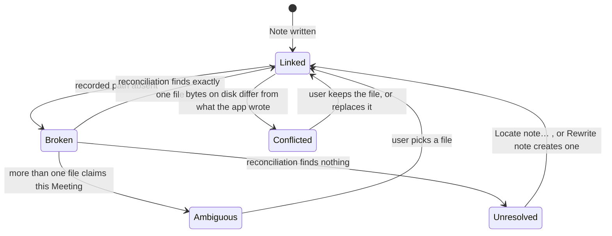

# Minutes — Experience

## Foundation

**Form factor:** macOS desktop, Apple Silicon, macOS 15+. Not responsive; not multi-surface.

**UI system:** SwiftUI on AppKit, using stock components — `MenuBarExtra`, `NavigationSplitView`, `Form`, `List`, `UNUserNotificationCenter`. There is no third-party UI library and no custom control library. Both spines inherit macOS platform behaviour; this document specifies only the behavioural delta from stock. Visual identity is `./DESIGN.md`, which owns every colour, type and spacing decision referenced here as `{token}`.

**Two surfaces, and only two** (PRD §10.1):

1. **Menu bar item** — the primary surface. Seen dozens of times a day, interacted with twice. Carries Session state and start/stop.
2. **Main window** — one window, sidebar-navigated. Setup, settings, and the Meetings library. Opened during setup, then rarely.

A third surface is a scope violation. Notifications are not a surface; they are a system affordance this product borrows.

**Interaction budget.** The product's core loop must cost **one click** (accept a Detection Prompt) or **two** (menu → Start Recording). Everything else in the product may cost whatever it costs, because it happens once.

## Information Architecture

### Menu bar menu

Contents are state-dependent and never exceed 8 items (PRD FR-5).

| State | Items |
|---|---|
| **Idle** | `Start Recording` · ─── · `Meetings…` · `Settings…` · ─── · `Quit Minutes` |
| **Recording** | *status line:* `Recording — 12:04` (disabled, `{typography.metric}`) · *stream line:* `Mic + System audio` or `Mic only ⚠` (disabled) · `Stop Recording` · ─── · `Meetings…` · `Settings…` · ─── · `Quit Minutes` |
| **Transcribing** | *status line:* `Transcribing "Weekly sync"…` (disabled) · `Start Recording` · ─── · `Meetings…` · `Settings…` · ─── · `Quit Minutes` |

Rules: `Start Recording` and `Stop Recording` are never both present (PRD FR-3). Status lines are disabled items, not headers, so they are readable by VoiceOver in menu order. Transcribing does not block a new Session — it queues (PRD FR-20).

### Main window sidebar

Grouped headings over a flat list, following the reference (PRD §10.2):

```
SETUP
  Getting Started        → checklist, playground, voice enrolment, re-run onboarding
CONFIGURE
  Transcription          → model selection + download
  Summaries              → summarisation backend selection, download, key
  Detection              → watched apps, suppression, master toggle
  General                → notes folder, your name, retention, launch at login,
                           remembered voices incl. the enrolled one, Dock
ACTIVITY
  Meetings               → the library
```

Increment 4 adds **no destination**. Voice enrolment is one checklist row and one card inside Getting Started, and one distinguished entry in a list General already had. A capability this central arriving without a new pane is the point, not a compromise (PRD SM-C2).

Default destination on first launch is **Getting Started**. Default destination thereafter is **Meetings** — after setup, the library is what a returning user wants. Selection persists across launches.

Each destination is one scrollable pane: a title, a one-line subtitle, then a vertical stack of `{components.card}`s with headings outside them.

### Surface closure

Every PRD requirement resolves to a surface, and every surface has a flow that lands there:

| Need | Surface | Flow |
|---|---|---|
| Start/stop a recording | Menu bar menu | KF-2 |
| Know whether it is recording | Menu bar icon | all flows |
| Be offered a detected meeting | Notification | KF-1 |
| Get set up | Getting Started | KF-4 |
| Confirm it actually works | Getting Started → Test Playground | KF-4 |
| Choose transcription quality | Transcription | KF-4 |
| Stop being asked about an app | Notification action, or Detection | KF-1 |
| Read a past meeting | Meetings → detail | KF-3 |
| Fix a speaker name | Meetings → detail | KF-3 |
| Retry a failure | Meetings → row action | KF-5 |
| Have Minutes know which voice is yours | Getting Started → Your voice | KF-8 |
| See or delete the voice Minutes stored | General → Remembered voices | KF-8 step 7 |
| Fix a wrong identification | Meetings → detail (rename, Exclude) | KF-3, KF-8 |
| Reclaim disk | General | — |

## Voice and Tone

Plain, specific, and never cheerful. The user is a professional using a utility; the copy's job is to be unambiguous and then get out of the way.

**Rules**

- **Say what will happen, not how you feel about it.** "Record this meeting?" not "Meeting detected!" — the second announces, the first asks, and asking is what the product does.
- **Every permission ask states the reason at the moment of asking**, in one line. "Minutes needs your microphone to record your side of the conversation." Never a generic "for full functionality".
- **No exclamation marks. No emoji. No first-person plural.** Not "We're all set!" — "Setup complete."
- **Name the thing that failed and the next action.** Not "An error occurred." → "Transcription failed — the model file may be incomplete. Re-download the model, then retry from Meetings."
- **Never claim certainty the system cannot provide.** System-audio capture state is *inferred*, so the copy says so: "Last recording captured system audio" — not "Permission granted" (PRD FR-42).
- **Absence is stated, not padded.** A meeting with no decisions omits the section. The UI never writes "No decisions found!" in a card.
- **Numbers over adjectives.** "About 6 minutes for a 30-minute meeting on this Mac" beats "Fast".
- **Never state the same fact twice on one pane.** If a card has already said that Apple Intelligence is off, the control below it says what *your choice* means now — "your choice cannot be honoured right now, so keyphrase extraction runs instead" — not the same state again in different words. Two statements of one fact on one pane invite the reader to hunt for the difference. *Added increment 4, from the Summaries pane, where the two sat forty lines apart.*
- **Never say a thing is missing before looking for it.** "This meeting's note is not in your notes folder" was true of the recorded path and false of the folder — the file was there under a name the user had given it, and the user was looking at it while the app denied it existed. The copy may report a file as not found only after reconciliation has run and found nothing, and then it says so in those terms: *"Minutes looked in your notes folder and could not find this meeting's note."* *Added increment 7.*
- **Never name a file an action will not touch.** A destructive dialog names the file that will actually be deleted, resolved at the moment the dialog is composed. If no file can be found it says that instead of naming the one the record remembers. A dialog that names a file it does not touch is a false statement made at the exact moment the user is deciding whether to trust it.
- **A remedy is never the action that makes the problem permanent.** Where two remedies exist they are distinguished by what they do to the file on disk, not by which is easier to say: *Locate note…* adopts a file that already exists, *Rewrite note* creates a new one from the record. Offering only the second for a renamed note is how a recoverable state became an unrecoverable one. *Added increment 7.*
- **Say what is stored, in the place it is stored.** Voice enrolment is the most sensitive thing the product keeps, so the copy names it without either softening it or dramatising it: "Minutes keeps a fingerprint of your voice on this Mac. The recording itself is deleted." Not "we take your privacy seriously", and not a warning triangle either — it is a thing the user chose, described accurately (PRD §9.1).

**Terminology is fixed by the PRD Glossary and used verbatim in the UI.** The user sees *Meeting*, *Transcript*, *Speaker*, *Note*, *Notes Folder*, *Transcription Model*. The UI never says "recording" for a Meeting or "session" to the user — *Session* is an internal term and must not leak into copy.

## Component Patterns

Behavioural specs. Visual specs are in `DESIGN.md § Components`.

### Checklist row (`{components.checklist-row}`)

The borrowed pattern (PRD FR-46, §10.3). Behaviour:

- **State is derived live, never stored.** Each row recomputes from actual system state on pane appearance and on window focus. A permission revoked in System Settings shows as outstanding again without an app restart (PRD FR-46). There is no "setup completed" flag.
- **Satisfied rows are inert** — the trailing `{components.pill-done}` is not focusable and not clickable. A satisfied row is still readable by VoiceOver, announced as "<title>, done".
- **Outstanding rows carry exactly one action**, which either performs the fix in place (request a permission, choose a folder) or navigates to the pane that does (Transcription for a missing model). Navigation selects the destination in the sidebar rather than opening a sheet.
- **Optional rows** are titled "… (Optional)" and never render as an error or block the "setup complete" state.
- Rows never reorder as they are satisfied. Position is stable so the list does not shuffle under the cursor.

The rows, in order. **Corrected in increment 4:** this table listed five rows and the shipped pane has had six since increment 2 — detection prompts was added as row 5 and never written down here. The seventh row is new.

| # | Row | Required | Satisfied when | Action when outstanding |
|---|---|---|---|---|
| 1 | Transcription model ready | yes | selected model is fully downloaded | `Choose Model →` (→ Transcription) |
| 2 | Microphone access | yes | `AVCaptureDevice` authorization is `.authorized` | `Grant Access` (requests in place) |
| 3 | System audio capture | no* | last capture attempt produced non-silent system audio | `Run Test →` (→ Playground) |
| 4 | Notes folder chosen | yes | a writable folder is set | `Choose Folder…` (opens picker) |
| 5 | Detection prompts | no† | notification authorization permits delivery | `Allow Notifications` (requests in place) |
| 6 | Test your setup | no | a Test Playground run has succeeded | `Run Test →` |
| 7 | **Your voice** | no‡ | an Enrolled Voice exists | `Record Voice` (runs the card in place) |

\* Row 3 is *not required* because PRD FR-7 degrades to Mic-only rather than failing. Its subtitle must say so: "Without this, Minutes records only your side of the conversation." This row is the one place the product's hardest constraint becomes visible to the user, and it must read as a trade-off, not a failure.

† Row 5 is not required because detection falls back to a floating panel, but it earns a row because with notifications denied the notification path is *silently* dead — which is how a real Teams call went unprompted with nothing to show for it.

‡ Row 7 is not required because everything works without it: with no Enrolled Voice, several voices on the microphone stay honestly anonymous. It is prominent because it is in this list rather than in a settings pane, and its subtitle says what it buys rather than what it is: **"Minutes can tell which voice in the room is yours instead of leaving it unattributed."** It sits last so that no shipped row is renumbered — position in this list is stable by rule, and that rule outranks putting the newest thing first.

### Test Playground (PRD FR-47)

The product's only diagnostic, and the reason the pattern was worth borrowing. macOS exposes no API to query system-audio permission, so this is how a user learns whether the app can do its job.

- One primary control: `Start Test`. Runs a fixed short capture (5 seconds), then transcribes.
- While running: a `{components.state-banner}` recording variant, a countdown, and a live level meter **per Stream** — the two meters are the diagnostic, and a flat System meter is the answer to "is system audio working".
- On completion, reports four things: the Transcript text; **per-Stream audio presence** (Mic ✓ / System ✓ or ✗); the model that ran; and **measured wall-clock transcription time with an extrapolation** ("2.1 s for 5 s of audio — roughly 6 min for a 30-min meeting"). That extrapolation is what makes the model picker honest (PRD §13 Q1).
- Failures are staged and named: no mic audio · no system audio · model missing · transcription failed. Never one generic error (PRD FR-47).
- A test run produces no Meeting and writes no Note. It must not appear in Meetings.
- Available any time, not only during first run. The user should reach for it after granting a permission or changing devices.
- Playing audio during the test is required for the System meter to move. The pane says so *before* the user starts: "Play something — a video, music — so Minutes can check it hears system audio."

### Voice enrolment (Getting Started, PRD FR-62)

A card in Getting Started, and deliberately **the Test Playground's card** rather than a new shape (`{components.enrolment-card}`). The Playground already taught the user what a countdown, a level meter and a result made of measured facts mean: the app is about to listen, and then it will say what it actually heard. Enrolment makes that exact promise.

- One primary control: `Record my voice`. Before it is pressed the card says how long it will take (about 25 seconds), what will be stored (a fingerprint), and what will not (the recording).
- **Nothing is stored until the recording completes.** Reading the card, pressing the button and cancelling, or closing the window mid-recording all leave the machine as they found it. This is what makes the feature opt-in rather than a default with an off switch, and it is a behavioural requirement, not an implementation note.
- The card tells the user what to do, before they start, in the Playground's voice: **"Read anything out loud — a paragraph of an email is fine. Talk normally, and let nobody else talk over you."** The second half is not politeness; a sample with two voices is rejected.
- While recording: `{components.state-banner}` recording variant, a countdown, and **one** `{components.level-meter}` labelled Microphone. One meter, not two — enrolment never opens the System Stream, so a System meter would be a lie about what is being read.
- On completion the result is facts, not a verdict: `{components.fact-chip}`s for seconds of speech found and number of voices found, then `Re-record`. No score, no "good sample!", no waveform portrait.
- **Failures are staged and named**, per the Playground's rule: microphone not granted · nothing was said · more than one voice in the sample · the sample was too short. "More than one voice" states plainly why it is refused — a fingerprint of two people would put a colleague's name on the user's words for months.
- Re-recording replaces the fingerprint. The copy says *replaces*, because a user re-recording is correcting something and averaging a correction into the error preserves it.
- An enrolment run produces no Meeting and writes no Note. It must not appear in Meetings — the Playground's rule, for the same reason.
- Available any time, not only during first run. The natural moment to reach for it is after reading a meeting where the room was labelled anonymously.

### Remembered voices row (General, PRD FR-51, FR-64)

`{components.voice-row}`. The Enrolled Voice lives in this list, as the same kind of row with a different glyph and a "You" badge — not in its own section and not in its own card.

- Ordering puts the enrolled entry first, then remembered colleagues alphabetically. It is the only entry that is *you*, and it is the only one whose deletion changes how future meetings are attributed.
- Both kinds carry provenance in the subtitle, because a one-sample guess and a twelve-meeting certainty must not look alike. The enrolled entry states how much audio produced it; a remembered colleague states how many meetings have confirmed it and when it was last heard.
- The enrolled entry offers `Re-record` and a delete. It offers **no rename** — the user's display name comes from "Your name in transcripts" in the same pane, and two places to edit one name is the defect this avoids.
- Deleting it returns attribution to pre-enrolment behaviour for meetings processed afterwards. Meetings already written keep their labels — FR-51's existing rule, and the reason it is stated again here is that a user deleting a fingerprint may reasonably expect history to change, and it does not.
- `Forget all` removes the Enrolled Voice too, and its confirmation **names it separately** from the count of remembered colleagues. A destructive action enumerates what it destroys (PRD FR-40), and "3 voices will be forgotten" hides the one that matters.
- The card states, in the same place the data is shown, that none of this leaves the Mac.

### Model row (Transcription pane, PRD FR-17, FR-18)

- Rows are radio-selection, one active. The active model is unambiguous (a selected state, not merely a checkmark in a list).
- Each row states: name, size on disk, and a speed/accuracy character **derived from measurement where a Test Playground run exists**, and from a static estimate otherwise — labelled as such. The product does not present an estimate as a measurement.
- A model not present shows `Download` with `{components.progress-download}` inline during download — determinate, with bytes and percentage.
- Selecting an undownloaded model starts its download and makes it active on completion, not before.
- A cached model shows a `Downloaded` marker and a `Remove` action, with the disk figure.
- The pane states once, plainly: "Downloading a model is the only time Minutes uses the network."
- An interrupted download leaves no partial model that could later load as valid (PRD FR-18). The row returns to the un-downloaded state and says the download was interrupted.

### Backend row (Summaries pane, PRD FR-56 … FR-60)

Deliberately the **same anatomy** as the model row above, not a second visual language — the user asked for this pane to be "similar to the model selection for transcription", and the point of a shared pattern is that a reader who has understood one row has understood the other. Where it differs, it differs because the underlying thing differs.

- Rows are radio-selection, one active, grouped by family with a heading per family: **On this Mac, built in** · **On this Mac, downloaded** · **Somewhere else**. The third heading is worded to make egress legible before any label mentions a key.
- Each row states, in this order: what it is *for* in plain language, then the provider, then the technical identifier, then its cost — disk size for a local model, an estimated per-meeting price for a remote one.
- **Readiness is a first-class column, not a footnote.** A row is in exactly one of: `Ready` · `Download` · `Blocked` · `Needs a key`. `Blocked` is the state that did not exist on the Transcription pane and is the most important one here.
- A `Blocked` row states the prerequisite and the remedy inline, and is **never** offered as selectable. It shows the reason where a `Download` button would be, so the reader learns why before reaching for an action. Two real cases: Apple Intelligence switched off, and the Metal toolchain not installed.
- A blocked prerequisite is shown **before** any download is offered. A multi-gigabyte fetch on a machine that cannot execute the result is the failure this rule exists to prevent (PRD FR-58).
- Download progress is determinate with bytes and percentage, reusing `{components.progress-download}`. The local-model registry reports continuous progress, so an indeterminate spinner here would be a regression against available information.
- Duration is `measured on this Mac` or `not measured yet` — never an estimate presented as a measurement, exactly as the model row requires.
- The pane names, once and near the top, which backend will run **for the next meeting** — which is not always the one selected, when a selection has become unavailable (PRD FR-57).

### Key entry (Summaries pane, PRD FR-59)

The only place in the product where anything leaves the machine, and the copy carries that weight rather than hiding it.

- A single obscured field, a `Save` action, and after saving the key is **never** rendered back — not masked, not truncated. Only "a key is saved" and `Remove`.
- Adjacent, not in a disclosure: what gets sent (transcript text), what never does (audio, speaker profiles), and who receives it.
- Entering a key does **not** enable sending. It makes sending possible. This distinction is load-bearing and the copy states it.
- A running total of spend sits in this card, so cost is observed rather than discovered.

### Send consent (per meeting, PRD FR-59)

- Consent is per meeting and is asked at the moment of sending, never pre-granted by a global switch.
- The ask names the recipient, the transcript length, the estimated cost, and **the participants whose speech it contains** — pulled from the meeting's own speaker labels. Seeing the names is the point.
- Declining is free and leaves the note with transcript, title and tags (PRD FR-55, FR-61).
- There is no "always send" checkbox. A per-meeting decision that can be permanently switched off is not a per-meeting decision.

### Meetings list and detail (PRD §4.8)

**Editing must not cost the transcript.** Typing in the title field or a speaker
name changes one line of text, and the Transcript below it is unaffected — so it
must not be re-rendered, which on a 598-utterance meeting means up to 228
paragraphs each forcing its own text-layout pass. The rule for implementers: the
grouped transcript is a value computed when the Meeting changes, not work done
while someone types. Stated as a behavioural requirement because the defect was
invisible in every small test meeting and only appeared on a real one.

**A row's prose gets its own line.** Any row that carries both controls and a
sentence puts the sentence beneath the controls. A single row cannot hold four
controls and two sentences at a detail column's width — it will not truncate, it
will collapse every child to its minimum and hyphenate words down the middle. This
is the same rule as the two above and the same reason: it was learned from the
built app rather than from the spine.


- Reverse-chronological rows: title, date, duration `{typography.metric}`, and `{components.speaker-chip}`s.
- A row carries its own state: transcribing (with progress), failed (with `Retry`), or complete.
- **A selected row owns the colour of everything inside it.** The system fills it with the user's accent, so every element that paints its own colour — chips, the recording and transcribing tints, secondary labels — surrenders that colour and takes the selection's foreground instead. State stays legible through the glyph beside it, and place through the chip's glyph. *Added increment 4:* all three were painting themselves unreadable on a selected row, and the chips were only the most visible of them.
- Detail is a read pane: metadata, then summary/decisions/actions if present, then the Transcript.
- Transcript rendering groups consecutive Utterances from one Speaker under a single label rather than repeating it per line (PRD FR-33).
- **Speakers group by where they were, and the device is named once per group.** "In the room with you · MacBook Pro Microphone", then its speakers; "On the call · system audio — Microsoft Teams", then its speakers. Place is the structural fact (AD-11), so it is the honest grouping — and it removes the eight identical copies of "heard through MacBook Pro Microphone" that made this section a wall on a fourteen-speaker meeting. *Added increment 4 after the user reported it as "stuff is squeezed together".*
- **One line per speaker**, and the provenance sentence appears **only where the app is making a claim** — an enrolment match, an automatically applied name, an unplaceable voice, an exclusion. On the other rows it restated the group heading above it. Four rows out of sixteen, not sixteen out of sixteen.
- **Renaming is available from any line in the transcript**, and the affordance is the speaker chip on that line. The transcript is where a voice is *recognised* — you read what someone said and you know who it was — so the fix belongs there and not only in a list which by then has scrolled away and where the speaker is a label with no words attached. The popover states that the rename applies to every line that speaker said, because clicking one line implies otherwise. *Requested directly by the user.*
- ~~**A speaker row is two lines, not one:**~~ *(superseded by the grouping above; kept because the reason it existed still binds — controls on a line, prose on its own line beneath.)* the chip, `Rename`, `Exclude` and the line count across the top, and one line of provenance underneath — what the app's claim about this voice rests on, and what it was heard through. *Written down in increment 4 after the one-line version broke:* it had grown to eight children including two unconstrained sentences, and SwiftUI took the width back out of all of them, rendering one character per line. The rule that prevents a recurrence is the same one `{components.voice-row}` and `{components.checklist-row}` already state — controls on a line, prose on its own line beneath — and it now covers every row in the product rather than two of three.
- Speaker rename is inline on the chip in the detail header — click the chip, type, commit. It is not buried in a sheet or a settings pane, because PRD FR-24 is a frequent action.
- Rename commits on Return or focus loss; Escape cancels. It rewrites the Note in place and, if the label was a Remote Speaker, updates the Speaker Profile (PRD FR-25).
- **Row actions depend on what is actually there, not on what the record remembers.** `Reveal in Finder` and `Open in Editor` appear only when a file has been located; a Note whose link is unresolved offers `Locate note…` and `Rewrite note` instead. *Corrected increment 7:* the row menu had offered Reveal and Open whenever a filename was recorded, so `Open in Editor` on a renamed Note handed the user macOS's own "the file does not exist" alert — which is the error the user reported. The detail pane had already split these two cases, and had a comment explaining why; the row menu never got the fix. **One rule, every surface that applies it.**
- Full action set: `Reveal in Finder` · `Open in Editor` (located only) · `Locate note…` · `Rewrite note` (unresolved, or on request) · `Retry` / `Finish transcription` (failed or interrupted only) · `Reveal recording in Finder` · `Delete…`.

### Note Link (Meetings list and detail, PRD §4.12)

The Note is the user's file, in the user's folder. They will rename it, move it and
edit it, and none of that makes it stop being this Meeting's Note. Everything in
this pattern follows from that one sentence, which the product did not believe for
its first six increments.

**Four states, and what each surface says.**

| State | The row | The detail pane |
| --- | --- | --- |
| **Linked, app-named** | nothing — this is the normal case and it is silent | `Reveal note`, and the filename is not shown, because the app chose it and it carries no information |
| **Linked, user-named** | nothing — a renamed Note is not a problem | the filename in `{typography.mono-inline}`, because the user gave it a meaning, plus `Reveal note` |
| **Unresolved** | `Note not found` with `doc.badge.ellipsis` | `{components.state-banner}` degraded: what was looked for, where, and the two remedies — `Locate note…` and `Rewrite note` — each saying which file it acts on |
| **Ambiguous** | `Note not found` | the files that both claim this Meeting, listed by name, with `Use this one` per file. The app never picks |

**Reconciliation is silent when it succeeds.** A renamed file that is found again
produces no banner, no badge and no confirmation. The user renamed a file; being
told the app coped is noise, and being asked to confirm their own action is worse.
The only visible trace is that the detail pane now shows the name they chose.

**The two remedies are never interchangeable.** `Locate note…` opens a file
chooser and adopts an existing file. `Rewrite note` renders a fresh file from the
record. The copy distinguishes them by what happens to the file on disk, and
`Rewrite note` on an unresolved link reconciles first — so it can only ever create
a file when nothing claims the Meeting.

**Pointing at a file the app did not write is allowed, and stated.** FR-79 lets
the user choose any Markdown file. If its frontmatter names a different Meeting,
the app says which one and asks. If it carries no Minutes frontmatter at all, the
app says plainly that the next rewrite of this Meeting would replace the file's
contents — before the link is made, not after.

**A Note changed outside Minutes is a `{components.decision-banner}`**, not a
degraded one, and not an alert. Two outcomes, both legitimate: keep the file as it
is, or replace it with a freshly rendered Note. The prominent control is the one
that changes nothing on disk. The choice is per Note and is never remembered — a
user who kept one hand-edited Note has decided nothing about the next one.

**Unclaimed Notes are a footer, not a section.** One line at the foot of the
Meetings list — *"1 note in your folder has no meeting"* — expanding to a list in
`{components.voice-row}`'s anatomy. It is a footer because it is almost always
absent and never urgent; it exists because a file the app wrote and then lost
track of must not be invisible, which is the state the user reported and the state
in which a real meeting was lost. Files Minutes did not write are never listed.

### Detection Prompt (notification, PRD FR-12)

- Body names the application: "Slack is using your microphone. Record this meeting?"
- Actions: **Record** (primary) · **Not now** · **Never for Slack**.
- The third action is what keeps the feature from becoming a nag, and it must be on the notification itself rather than only in Settings (PRD FR-15).
- Ignoring it is a decline. It expires on the system's own schedule and starts nothing (PRD FR-12).
- One prompt per detected meeting. A declined meeting is not re-prompted while the same input session continues.

## State Patterns

### Session state machine

`Idle → Recording → Transcribing → Idle`, with two branches off Recording.

| State | Menu bar icon | Menu | Window banner |
|---|---|---|---|
| **Idle** | `waveform`, template tint, no animation | `Start Recording` | none |
| **Recording** | `record.circle.fill` @ `{colors.state-recording}`, **steady** | elapsed time, stream status, `Stop Recording` | recording variant with elapsed time |
| **Recording (degraded)** | same as Recording | `Mic only ⚠` on the stream line | degraded variant: "Recording your microphone only — system audio isn't being captured." |
| **Transcribing** | `ellipsis.circle` @ `{colors.state-transcribing}` | which Meeting, `Start Recording` available | transcribing variant with progress |
| **Transcription failed** | back to Idle | Idle menu | failure surfaces in Meetings, not the menu bar |

Transitions must be honest about timing: the icon turns Recording only when audio is **actually being captured**, not when the click happens (PRD FR-3). If tap creation takes a moment, the icon waits.

### Degradation, never silence

Three degradations, each of which must be visible (PRD NFR-5, FR-7):

1. **System audio unavailable** → record Mic-only, say so in the menu, in the window banner, and in the Note's frontmatter.
2. **Diarization unavailable or failed** → the whole System Stream becomes one `Speaker` label rather than failing the Meeting (PRD FR-22). The Note records it.
3. **LLM Backend unavailable** → the Heuristic Backend runs. The Note names the backend that ran (PRD FR-30). This is **not** surfaced as a warning — it is the expected path on this machine, and treating it as an error would be dishonest.

### What the recording itself can be wrong about (PRD §4.13, §4.14)

*Written down in increment 10, covering increment 8's and increment 9's notices as
well as this increment's. Three notices were already shipping and none of them was
in this document, which is how the fourth nearly arrived without an ordering rule.*

These are not degradations of a *feature*. They are statements about the audio,
and a reader who has only the Note months later has nothing else to go on. They
share one surface — a `{components.state-banner}` at the top of the Meeting
detail, and a blockquote in the same order at the top of the Note — and one
ordering rule.

**Order by how misleading the transcript below is, worst first.** Not by
severity, not by chronology, not by which requirement is newest:

| # | Notice | Why it sits here | PRD |
|---|---|---|---|
| 1 | **This stream is not reliable** | The transcript below is fluent invented dialogue. It is the only notice that makes what follows *actively false* rather than incomplete. | FR-87 |
| 2 | **Part of this recording was lost while it was being made** | *New in increment 11, and it goes second rather than third.* Audio the app received and never wrote. It ranks above the two rows below it for the same reason row 1 outranks everything: what is there may not be true. A gap (row 4) is a hole with a known position that can be marked in place; a lost stretch leaves the file **continuous across the join**, so the words either side become adjacent when they never were, and two half-sentences can read as one sentence nobody said. Small in extent and misleading in kind, which is exactly the axis this table is ordered on. | FR-102 |
| 3 | **Only your microphone was captured** | The far end is missing entirely; what is there is true. | FR-7 |
| 4 | **Minutes could not read part of this recording** | Speech the app had and failed on. Incomplete, and — unlike the row above — invisible without being told, because a gap looks exactly like a pause. | FR-96 |
| 5 | **Your microphone also picked up the call** | Something the app *handled*. The far end is counted once. Last because it describes a correction, not a loss. | FR-92 |

*Rows 2 through 5 were rows 1 through 4 plus one insertion; the numbers are
positions in this ordering and nothing outside this table refers to them.*

**A lost stretch is disclosed above a floor, and the floor is derived rather
than picked.** The count itself is always on the record, whether it is zero or
not (PRD FR-102) — that is the measurement and it has no threshold. This is a
separate question: whether it is worth telling the reader. Say it when the
unaccounted-for audio exceeds **0.4 seconds**, which is one word at a
conversational 150 words a minute. Below that no word can have been lost whole,
so the worst available outcome is a clipped one; above it, a word the reader will
never see is gone from a transcript that does not look interrupted. Measured, the
two cases this separates are **22 ms on the Mic Stream and 8.37 s on the System
Stream of the same recording** — a factor of 380, with the floor three orders of
magnitude clear of the noise and one order clear of the smallest real fault. It
is a disclosure floor and never a detection tolerance: nothing is absorbed by it,
because the number it hides from the banner is still recorded, still printable,
and still what a regression would be caught by.

**It names the amount and which stream, and it does not pretend to a position.**
*"About 8 seconds of the call's own audio was lost while this was being recorded,
in 3 separate stretches. The transcript below runs straight across those joins,
so a sentence there may be two halves of different ones."* Naming the stream
matters: on the Mic Stream the loss is the user's own voice and on the System
Stream it is everyone else's, and a reader deciding whether to trust a decision
attributed to a colleague needs to know which. Unlike a gap (row 4) it is **not**
marked in place, because the app does not know where in the file the samples were
dropped — only how many. Claiming a position would be the more useful answer and
the app does not have it.

**A gap is not silence, and the wording must not let the two be read as one.**
"Nothing was said here" and "we could not read what was said here" are different
statements about the same seconds, and the second one is the one a summary must
not be trusted over. So the notice names the amount and says which it is:
*"Minutes could not make out about 4 minutes of this recording, spread over 6
places. Those parts are missing from the transcript below, and from the summary."*
Echo-excluded audio is **never** counted here — it is speech Minutes has, once,
on the other stream — and conflating the two would report a working feature as a
failure.

**Where a gap falls inside the transcript, it is marked in place**, once, at its
position, in `{typography.metric}` and `{colors.text-secondary}` — not as a
banner repeated per gap and not as a red state. A reader scanning a conversation
needs to know that a turn is missing at the moment they would otherwise assume
continuity.

**Confidence is a proportion, never a score.** The engines report a per-segment
confidence that is not calibrated against anything, so the product must not
render it as a number, a percentage per line, a bar, or a rating — every one of
those invites a reader to compare two values that do not mean the same thing.
What it may honestly say is how much of the transcript the engine itself was
unsure of, once, in the provenance block, and only when that share is
substantial. An engine that reports no confidence produces **no sentence at
all** — absent is unknown, and "we do not know" must never be rendered in the
place where "we were not confident" would go (PRD FR-95, AD-52).

**How the recording was made belongs in provenance, not in a banner.** That
Minutes was on loudspeakers rather than headphones, and that echo cancellation
ran, are facts about the capture and not problems with it. They sit with the
model name and the backend name at the foot of the detail pane and the Note.
They appear only where they are known: a Meeting recorded before the app looked
says nothing, rather than saying "unknown".

*Extended in increment 11.* The same rule takes three more capture facts, and it
takes them for the same reason — they describe how the recording was made and a
reader cannot act on any of them. **How far apart the two Streams started**
(PRD FR-97, FR-104), **the closest the recording came to outrunning its own
buffer** (FR-103), and **the accounting of what reached the file** (FR-102) all
belong at the foot beside the model name, not in a banner. A start offset the
merge has already applied is not a problem with the recording; a buffer that
peaked at 4% of capacity is a reassurance rather than a notice; and a
fully-accounted-for capture has, by definition, nothing to disclose. Only the
banner above crosses into the reader's way, and only above its floor.

**Zero is printed, and absent is not.** A capture that accounted for every
sample says so — *"every sample the devices reported reached the file"* — because
that sentence is what makes its absence on some future recording legible. A
Meeting recorded before increment 11 has no counts and says nothing at all,
which is the same rule the rate check, the Echo verdict and the output device
already follow: absent is unknown, and unknown is never rendered where a
measurement would go.

### Voice enrolment state machine (PRD FR-62)

`Idle → Recording → Analysing → Enrolled`, with two exits.

| State | Card | Meter | What the user is told |
|---|---|---|---|
| **Idle, never enrolled** | `{components.state-banner}` info + `Record my voice` | one, flat | how long it takes, what is stored, what is deleted |
| **Recording** | recording banner + countdown | one, live | seconds remaining, and to let nobody else talk |
| **Analysing** | transcribing banner | one, frozen | that it is working out the fingerprint on this Mac |
| **Enrolled** | `{components.fact-chip}` facts + `Re-record` | none | seconds of speech found, voices found |
| **Refused** | degraded banner naming the reason | none | which of the four failures occurred, and what to do |
| **Idle, already enrolled** | `{components.pill-done}` on the row; card shows the facts | none | when it was recorded, and that re-recording replaces it |

Nothing is written to disk before **Enrolled**. `Refused` and a cancelled `Recording` are indistinguishable from never having started, by design.

### Identity, claimed or refused (PRD FR-63, FR-65)

The product now has three possible answers to "which voice on the microphone is the user", and the interface must make them look different, because two of them are honest and only one is an identification.

| Situation | Label | Chip | Where the reason is visible |
|---|---|---|---|
| One voice on the microphone | the user's name | `{components.speaker-chip}`.local | provenance chip: structural, cannot be wrong |
| Several voices, Enrolled Voice matches one | the user's name | `{components.speaker-chip}`.local | meeting detail states it was recognised from the enrolled voice, and how close |
| Several voices, no Enrolled Voice or no clear match | `In-room 1…N` | `{components.speaker-chip}`.room | provenance chip: several people in the room |
| Mic speech the diarizer could not place at all | `In-room, unidentified` | `{components.speaker-chip}`.room | the label itself is the disclosure |

Two rules over the table:

- **A claim states its basis.** The second row looks identical to the first in the transcript, and it must not be identical in the detail pane: one is a structural fact and the other is a measurement that could be wrong. The detail says which, and shows the measured distance as a fact.
- **A refusal is not an error.** Rows three and four render in the ordinary in-room treatment with no warning glyph. The app declining to guess is the product working, and dressing it as a failure would push a user toward wanting the guess back.

### Note Link state machine (PRD FR-78, FR-81)



**`Broken` is never a state the user sees.** It exists for one turn — the moment
an existence check fails and before reconciliation has answered — and every user-
visible state is downstream of an answer. This is the whole correction: the app
used to render `Broken` as "your note is missing", which is a claim it had not yet
earned.

**`Unresolved` and `Ambiguous` persist nothing.** They are display states, exactly
as the missing-note check has always been. Only a positive identification is
written to the record, because *this file is this Meeting's Note* is durable and
*this file is not there right now* is not.

**`Conflicted` blocks the write that discovered it.** A rewrite that finds
unrecognised bytes does not proceed and does not partially write. The rename or
retitle that triggered it is still applied to the record — the record is not the
file, and holding an edit hostage to a file conflict would be a second defect.

### Capability readiness (PRD FR-58)

A fourth state family, added in increment 3. The product already distinguishes *working*, *degraded* and *failed*; this adds **blocked**, which is none of those: nothing has gone wrong, and the machine simply cannot do the thing yet.

| State | Means | Shows |
| --- | --- | --- |
| `Ready` | usable now | the selection control |
| `Download` | usable after a fetch | size and a determinate download |
| `Needs a key` | usable after configuration | what to configure, and what sending means |
| `Blocked` | not usable until something outside the app changes | the prerequisite **and** the remedy, no action button |

Rules that apply to all four:

- A blocked capability is never silently hidden. Hiding it means the user asks "why can't this app do X" and gets no answer, which is what happened with Apple Intelligence in increment 2 — the app knew the reason and never said it.
- A blocked capability is never silently substituted either. Falling through to a lesser backend without saying so is how a keyphrase extract came to be read as a summary.
- The remedy must be specific enough to act on. "Install the Metal toolchain" is not a remedy; `xcodebuild -downloadComponent MetalToolchain` is.
- Readiness is re-read when the pane appears, so fixing a prerequisite outside the app is reflected without relaunching — the same rule the checklist already applies to permissions.

### Empty, loading, error

- **Meetings, empty:** one line of text and nothing else — "No meetings yet. Click the menu bar icon to record one." No illustration, no mascot.
- **Loading:** panes render their structure immediately with content filling in. No full-pane spinners; the window must never appear to hang.
- **Errors:** stated in place, in the pane that owns the thing that failed, with the next action as a button. Never a modal alert for anything the user did not just initiate.
- **A destructive action confirms, enumerates, and is recoverable.** Deleting a Meeting names exactly what is removed — Note file, audio, or both — before removing it, and what it removes goes to the Trash (PRD FR-40 as amended). *Amended increment 7, retrospectively:* the confirmation named a file it could not find and therefore did not delete, and the recording it did delete was unlinked rather than trashed, so a real meeting is gone. A confirmation dialog is not a substitute for a route back. The enumeration is resolved when the dialog is composed, so it describes the filesystem rather than the record.

## Interaction Primitives

- **Menu bar click** — opens the menu. Left-click only; no distinct right-click menu, because two menus on one icon is a discoverability trap.
- **Single-click** activates in lists; no double-click-to-open. Selection and activation are the same gesture in a list this shallow.
- **Return** commits an inline edit; **Escape** cancels it and restores the prior value.
- **No drag and drop** anywhere. No custom gestures. No hover-only affordances — anything actionable is visible without hovering. A borderless button in a row full of text is a hover-only affordance in practice, whatever the code says.
- **A per-row affordance is keyed by the row, never by what the row is about.** A speaker owns one transcript block per turn, so keying a rename popover by speaker presented one popover per block — nine for a single click in a real meeting, and the one SwiftUI drew was not the one clicked. The key is the block's own identity. The general form: if two rows can share the value you keyed on, the key is wrong.
- **A modifier that can only present once is attached once.** Putting a `.popover` on all 708 transcript rows cost a layout pass per row per click, which is what "slow to pop up" was. Attach it to the row that is actually presenting.
- **An action offered as a remedy must not be the action that makes the failure permanent.** Where the app presents a fix for a broken state, that fix is checked against the state it does *not* handle: `Rewrite note` on a renamed Note would have created a duplicate and orphaned the user's file forever, and it was the only thing on offer. The general form: before shipping a remedy, ask what it does in the case the app has misdiagnosed. *Added increment 7.*
- **A row of controls adapts rather than assuming a width.** `ViewThatFits`: one line where it fits, stacked where it does not. A row that overflows its container is the same defect as a row that compresses its children, and the second one shipped twice.
- **Global hotkey:** none in v1. It is a real convenience but it is a new permission surface and a conflict-resolution UI, and PRD §5 keeps the surface small. Logged as a v2 candidate.
- **Window behaviour:** closing the window does not quit the app (it is menu-bar-resident). Reopening restores the last sidebar selection. Only one window ever exists (PRD FR-5).
- **Notification actions** perform without bringing the app forward. Clicking `Record` starts the Session and does not steal focus from the meeting the user is in — this matters, because the user is mid-conversation.

## Checking a layout claim

`./Scripts/uishot.sh` renders every pane with fixture data at three widths. Any
behavioural claim in this document about what fits, wraps or truncates is
checkable that way, and two increments of layout defects reached the user because
it was not. The tool cannot render `Button`, `Picker` or `ProgressView`, so it
answers *does this layout hold*, not *is the app correct*.

The fixtures are deliberately harsher than reality — sixteen speakers, a
40-character name, a 320pt column — because a fixture covering only the easy case
is the reason the hard case shipped.

## Accessibility Floor

Behavioural; visual contrast is `DESIGN.md`'s.

- **Colour is never the only signal.** The three Session states differ in silhouette as well as tint (PRD FR-2, NFR-7). The stream-status line spells out "Mic only" rather than relying on the warning tint.
- **Full keyboard navigation.** Every pane is reachable and operable by keyboard: sidebar via arrow keys, panes via Tab, buttons via Space/Return. Focus order follows visual order. No control is mouse-only.
- **VoiceOver labels that state meaning, not appearance.** The menu bar item announces "Minutes, recording, 12 minutes 4 seconds" — not "red icon". Checklist rows announce title, done-or-outstanding, and the subtitle. `{components.pill-done}` is announced as status, not as a button.
- **Live regions for state changes.** Session start/stop and transcription completion are announced.
- **Text scales.** All type uses macOS text styles (`DESIGN.md § Typography`), so accessibility text sizes work. Panes must remain usable at the largest setting — which means no fixed-height rows containing text.
- **Increase Contrast and Reduce Transparency are honoured** by using system materials rather than custom translucency.
- **Reduce Motion:** there is no motion to reduce beyond progress indicators. State transitions do not animate, and since increment 4 neither does the menu bar icon in any state (PRD FR-50, withdrawn) — so Reduce Motion needs no special path here rather than being honoured by a branch.
- **No timed interactions.** The Detection Prompt expires on the system's schedule, and letting it expire is a safe default (decline). Nothing else is time-limited. Voice enrolment's countdown is not an exception: the user is not required to *act* within it, only to keep talking, and abandoning it stores nothing.
- **Voice enrolment must be completable without seeing the meter.** The countdown is announced, the result is announced as text, and the meter is confirmation rather than instruction. A user who cannot see the level must still be able to tell that the sample was accepted, and why it was not.
- **Identity announcements state their basis.** VoiceOver on a local-speaker chip announces "you, recognised from your enrolled voice" when that is how it was decided, and "you, the microphone held a single voice" when it was structural. The distinction is the honesty guarantee, so it cannot be visual-only.

## Permission Choreography

*Invented section. This product's UX is dominated by two macOS permissions with wildly different ergonomics, and getting the sequence wrong is the difference between a working app and a silently broken one (PRD §12).*

Three principles:

1. **Ask at the moment of need, with the reason.** Microphone permission is requested during Getting Started because the app is useless without it. System-audio permission cannot be requested at all — it is triggered by the first capture attempt — so the product must *forecast* it: Getting Started states, before any recording happens, that macOS will ask on the first recording and what declining costs.
2. **Never claim certainty the platform does not offer.** Microphone state is queryable and is stated as fact. System-audio state is **inferred from whether the last capture produced non-silent audio** and must always be phrased as observation: "Last recording captured system audio." The Test Playground exists to generate that observation on demand.
3. **Make re-granting discoverable, because it will happen.** The app is ad-hoc signed, so consent is invalidated whenever the binary changes (PRD §12). This is the single most likely cause of "it stopped working". Therefore:
   - The System audio checklist row flips back to outstanding as soon as a capture yields silence.
   - Its outstanding subtitle names the real cause in plain words: "macOS revokes this when Minutes is rebuilt."
   - The Detection pane and the row both offer a copyable reset command and a link to the relevant System Settings pane (PRD FR-42).

**First-recording sequence** — the one moment the two permissions collide:

1. User starts a Session (menu, or accepting a Prompt).
2. Mic capture begins immediately. Icon → Recording.
3. System tap creation fires the macOS system-audio prompt. **The Session is already recording** — the user is mid-meeting and must not be blocked by a dialog.
4. If granted, the System Stream joins. If declined or ignored, the Session continues Mic-only and the degraded banner appears.
5. Either way, the Session completes and produces a Note. The Note records which Streams were captured.

Never block the start of a recording on a permission dialog. A meeting is happening; capturing half of it beats capturing none.

## Key Flows

### KF-1. Niklas is offered a huddle he would have forgotten to record *(PRD UJ-1)*

1. **Entry:** Minutes Idle in the menu bar; Niklas at his desk. He joins a Slack huddle.
2. Within ~15 s of Slack taking the microphone, a notification: *"Slack is using your microphone. Record this meeting?"* — `Record` · `Not now` · `Never for Slack`.
3. He clicks `Record`. Focus stays in Slack. Icon → Recording red within 2 s.
4. He talks for 22 minutes and does not think about Minutes again.
5. Slack releases the mic. Within 30 s the Session stops on its own. Icon → Transcribing amber.
6. **Climax:** a notification names the finished meeting — *"'Pricing page copy' saved — 22 min, 3 speakers"* — and the file is in his notes folder, titled, tagged and speaker-attributed. He did one click for the whole artifact.
7. **Resolution:** icon back to Idle. **Edge case:** ignoring the notification records nothing; silence is a decline, never a default yes.

### KF-2. Niklas records something Minutes cannot detect *(PRD UJ-2)*

1. **Entry:** a call on a surface with no Watched App.
2. Menu bar → `Start Recording`. Icon → Recording.
3. Mid-call he switches to AirPods; recording continues, gap under 2 s (PRD FR-8).
4. Menu bar → `Stop Recording`. **Climax:** icon → Transcribing, then Idle, and the Note lands.
5. **Edge case:** a manually started Session is *never* auto-stopped, even if a Watched App releases the mic meanwhile (PRD FR-14).

### KF-3. Niklas names a colleague, once *(PRD UJ-3)*

1. **Entry:** Meetings pane, a completed meeting with `Me`, `Speaker 1`, `Speaker 2`.
2. He opens it, reads the first line attributed to `Speaker 2`, recognises the phrasing.
3. He clicks the `Speaker 2` chip in the detail header and types `Mikkel`, Return.
4. **Climax:** every `Speaker 2` line becomes `Mikkel`, the Note rewrites in place, and a Speaker Profile is stored.
5. **Resolution:** next week's standup arrives with that voice already labelled `~Mikkel` — the prefix marking it inferred, so a wrong match is visible.
6. **Edge case:** one person split across two labels is fixed by renaming both to `Mikkel`, which merges them (PRD FR-24).

### KF-4. Niklas sets it up once *(PRD UJ-4)*

1. **Entry:** first launch. Icon appears; the window opens on **Getting Started**.
2. Quick Setup shows seven rows, five outstanding. Each says in one line why it exists.
3. `Grant Access` on Microphone → system prompt → row flips to `Done` and recedes.
4. `Choose Folder…` → picker → row satisfied.
5. `Choose Model →` navigates to Transcription. He takes the recommended default; it downloads with determinate progress and a byte count. Row satisfied.
6. Row 3 (System audio) is still outstanding and marked not-required, its subtitle explaining that macOS will ask on first recording and that declining means his side only.
7. **Climax:** he clicks `Run Test →`. The pane tells him to play something. Two level meters move. Five seconds later: the transcribed words, `Mic ✓ System ✓`, the model name, and *"2.1 s for 5 s of audio — roughly 6 min for a 30-min meeting."* He now knows it works, on his machine, with numbers.
8. **Resolution:** the four required rows are satisfied and the pane says "Setup complete." Two optional rows remain outstanding and neither reads as an error — detection prompts, which he grants when the first huddle is detected, and `Your voice`, which he comes back for in KF-8 once he has read a meeting that needed it. He closes the window and does not open it for weeks.
9. **Edge case:** if the System meter stays flat, the result says `System ✗` with the reason and the reset command — the failure is diagnosed, not merely reported.

### KF-6. Niklas gets a real summary without depending on Apple Intelligence *(PRD FR-55 … FR-61)*

The flow that this increment exists for. Niklas has read four meeting notes whose "summary" was four sentences copied out of the transcript, and has decided he would rather have none.

1. He opens **Summaries** and reads, at the top, which backend will run for his next meeting: *Keyphrase extraction — titles and tags only, no summary.* That sentence is the first honest answer the product has given him on this subject.
2. The list shows three families. **Apple's on-device model** is `Blocked`: *Apple Intelligence is switched off. Turn it on in System Settings › Apple Intelligence & Siri.* He notes it and moves on — he has already decided not to depend on it.
3. **On this Mac, downloaded** offers three sizes with real disk figures. The middle one is `Blocked` too, and gives the reason he could not have guessed: *Needs Xcode's Metal toolchain.* `xcodebuild -downloadComponent MetalToolchain`. The app does not offer him a 3 GB download it knows cannot run.
4. He installs the toolchain, returns to the pane, and the rows are now `Download` — he did not relaunch, and nothing told him to.
5. He downloads the middle model with a real progress bar, records a five-minute meeting, and reads a summary written by a model on his own machine. The note's frontmatter names that model.
6. **Somewhere else** is still `Needs a key`, unused. Nothing has left his Mac at any point in this flow, and the pane says so.

**The climax is step 3** — the moment the app tells him something he could not have found out himself, instead of failing quietly or offering a download that would have wasted twenty minutes and three gigabytes.

### KF-7. Niklas considers sending a transcript away, and sees who is in it *(PRD FR-59)*

1. He has entered a key. He records the company all-hands.
2. At the moment of sending, the ask names the recipient, the transcript length, the estimated cost — and lists the participants whose speech it contains. Thirty-seven names.
3. He declines. The note keeps its transcript, title and tags.

**The climax is the list of names.** The decision is not "do I want a better summary"; it is "am I sending thirty-seven colleagues' words to a vendor". The interface's job is to make sure that is the question being answered, and this is the one flow where the product deliberately makes an action harder rather than easier.

### KF-8. Niklas tells Minutes which voice is his *(PRD FR-62 … FR-65)*

The flow this increment exists for. Niklas has just read the note from an eight-person Slack huddle he took at his desk with two colleagues talking beside him. Roughly half the transcript is their conversation, and the app had correctly separated the voices and correctly refused to say which was his — so the note reads `In-room 1`, `In-room 2`, `In-room, unidentified`, and none of it is wrong and none of it is useful.

1. **Entry:** he opens **Getting Started**. Six rows are satisfied and receding. Row 7 is outstanding and reads: *Your voice — Minutes can tell which voice in the room is yours instead of leaving it unattributed.* Marked optional.
2. He presses `Record Voice`. The card below tells him it takes about 25 seconds, that a fingerprint of his voice will be kept on this Mac, and that the recording itself will be deleted.
3. He presses `Record my voice` and reads a paragraph out loud. A countdown runs; one meter moves. Nobody else talks, because the card asked him not to let them.
4. **Climax:** four seconds later the card says `24 s of speech` · `one voice`. Row 7 flips to `Done` and recedes with the others. He did nothing else, and nothing was asked of him twice.
5. Next morning's huddle, same desk, same two colleagues. The note comes back with **his** lines under his own name and theirs under `In-room 1` and `In-room 2`. The meeting detail says the local speaker was recognised from his enrolled voice, and how close the match was.
6. **Resolution:** the `In-room, unidentified` label still appears twice, for mic speech the diarizer could not place at all. That is correct and he leaves it. He clicks `Exclude` on `In-room 1` — the colleague who was on a different call — and the note omits that speech while the app keeps it.
7. Weeks later he opens **General** out of curiosity and sees his own voice at the top of Remembered voices with a `You` badge and *24 s of audio · recorded 12 September*. There is a delete next to it. He does not press it, and the fact that he could is the point.

**The climax is step 4 and it is deliberately dull** — 25 seconds, two facts, a row going quiet. Everything interesting happens in step 5, in a meeting he is not thinking about the app during. **Edge case:** if a colleague talks over him during step 3, the card refuses the sample and says *more than one voice was in the recording* — because a fingerprint of two people would put a colleague's name on his words for months, and one wasted attempt is cheaper than finding that out in October.

### KF-9. Niklas renames a note in Finder, and Minutes agrees with him *(PRD FR-78 … FR-83)*

The flow this increment exists for, and the only one in this document written from
a failure that had already happened. Niklas records a 13-minute team standup.
The heuristic backend titles it `Actually`, from a word somebody said early on. The
note lands in `~/Documents/Minutes` as `2026-09-03 0930 Actually.md`.

1. **Entry:** he is in Finder, in his own notes folder, filing the morning's work. `Actually` tells him nothing, so he renames the file `2026-09-03 0930 Morning -standup.md` — in Finder, because that is where he already is.
2. He switches to Minutes. **Nothing has changed.** The row does not say the note is missing, because before saying anything the app looked: the recorded path was absent, so it read the frontmatter of the files in the folder, found exactly one carrying this Meeting's ID, and relinked. No banner, no dialog, no confirmation of a decision he already made.
3. **Climax:** the detail pane shows `2026-09-03 0930 Morning -standup.md` beside `Reveal note`. The app is calling the file what Finder calls it. It is a two-line change on screen and it is the entire point: the app has stopped having a private opinion about the name of the user's file.
4. He renames a speaker in the transcript. The note is rewritten — under **his** filename, not back to `Actually.md`, because the app knows the name on disk is not the name it wrote and has stopped correcting it. The title inside the file still says `Actually`; he double-clicks the title in the app and fixes that too, which is where titles are edited and always was.
5. **Resolution:** a week later he deletes a test meeting and ticks *also delete notes*. The dialog names the file it is about to remove — resolved from the folder, not remembered from the record — and says it goes to the Trash. It does.

**Edge case, the one that cost a meeting:** if the file had been renamed *and* its
Meeting deleted, the note would be an Unclaimed Note and the Meetings list would
say so in a footer, with `Reveal` next to it. It is not offered as an import,
because a Note cannot be turned back into a Meeting — but it is never invisible
again. On the day this flow was written that exact file existed on the author's
disk, its meeting permanently deleted, and no surface in the product mentioned it.

**Edge case, hand edits:** if he had added a paragraph of his own to the note, the
rewrite in step 4 would not have happened. The app compares what it last wrote
with what is on disk, finds them different, writes nothing, and offers him the two
outcomes — keep his file, or replace it. It does not recommend one.

### KF-5. A transcription fails and nothing is lost *(PRD FR-19, FR-39)*

1. **Entry:** a Session stops; transcription fails (interrupted model download).
2. Icon returns to Idle. No modal — the user did not initiate this moment.
3. The Meetings row shows `Failed` with a reason and a `Retry` action.
4. **Climax:** he re-downloads the model in Transcription, hits `Retry`, and the Meeting transcribes from retained audio. Nothing was re-recorded.
5. **Edge case:** if audio retention was set to delete-after-Note, `Retry` is absent and the row says why (PRD FR-44).

## Open Questions

1. **Level-meter feasibility for the System Stream before permission is granted** — if a denied tap yields no callbacks at all, the meter cannot distinguish "denied" from "silent". KF-4 step 9 depends on telling those apart; the Playground copy may need to say "no system audio detected — either permission was declined or nothing was playing."
2. **Notification action reliability while another app is fullscreen** — Slack huddles are often fullscreen; if actionable notifications are suppressed in Do Not Disturb or fullscreen, KF-1 breaks and the menu bar becomes the only path. Needs a real test.
3. **Whether "Never for Slack" belongs on the notification** — it is the right place for it, but a mis-click is destructive to the feature's value. Possibly needs an undo affordance in Detection.
4. **Speaker chip inline rename in the detail header** assumes few enough speakers to fit. Behaviour above ~6 speakers is unspecified.

## Open Questions — increment 3

- **How many local models should the curated list offer?** Three sizes is the working assumption, mirroring the Transcription pane's shape. Depends on PRD §13 Q13 (is a 4-bit model in this class good enough at all) and cannot be settled before that is measured.
- **Where does the per-meeting send consent live?** A sheet on the Meetings detail, or a notification like the Detection Prompt? The Detection Prompt precedent argues for a notification, but consent to transmit is a heavier decision than consent to record and probably deserves the window.
- **Does the Summaries pane need its own Test Playground?** FR-47's pattern turned an unanswerable permission question into an empirical one. The same argument applies to "is this model's summary any good", and the answer is a sample summary of a real past meeting. Not yet a requirement.

## Open Questions — increment 4

- **Does the enrolment row belong last?** It is last so no shipped row is renumbered, and rows never reorder by rule. But it is the most valuable outstanding row a returning user has, and it sits below a satisfied `Test your setup` that has receded to 55% opacity. If it goes unnoticed, the alternative is not moving it — it is a one-line prompt in the meeting detail of a meeting that was left unattributed, which is where the user actually feels the problem.
- **Should the meeting detail offer enrolment when it would have helped?** A meeting labelled `In-room 1` / `In-room 2` with no Enrolled Voice is the exact moment the feature explains itself. Offering it there risks becoming a nag, which PRD SM-C1 exists to prevent; not offering it risks the feature never being found. Not decided, and deliberately not built in this increment.
- **What does the card do when the machine has two microphones?** The fingerprint is recorded through whatever input is active, and the spike already found the app had been recording through AirPods without recording *that* it had. If a fingerprint turns out to be device-coloured (PRD §13 Q19), the card needs to name the device it recorded through, and possibly hold more than one sample. Unmeasured, so unspecified.
- **Is "fingerprint" the right word?** It is concrete and honest, and it also carries a forensic connotation the product does not intend. "Voice profile" is softer and vaguer. Chosen "fingerprint" for the card copy and "your voice" for the row title, on the grounds that the sensitive thing should be named plainly where it is created and plainly where it is stored, and does not need naming in a checklist row.

## Assumptions — increment 4

- The card's parent shape being the Test Playground's, rather than something new, is a judgement about consistency and not a stated requirement. It is the strongest assumption in this increment and the easiest to reverse.
- 25 seconds inside the specified 20–30 range, and a single continuous take rather than three short prompts. Not specified; a single take is the shorter path to a usable sample and asks nothing of the user's patience twice.
- Rejecting a two-voice sample rather than accepting it with a warning. Inferred from the cost asymmetry: a bad fingerprint is silent and lasts months, and a second attempt costs 25 seconds.
- The enrolled entry sorting first in Remembered voices. Not specified; it is the only entry that is the user and the only one whose deletion changes future attribution.
- No rename on the enrolled entry, with the name owned by "Your name in transcripts". Not specified; chosen so one name has one home.
- Showing the measured match distance in the meeting detail as a fact. PRD FR-65 requires the identification be disclosed and forbids a *settable* threshold; that a measured number may be *displayed* is this document's reading, on the same grounds as the Playground's throughput figure — a number the user cannot set but can check is honesty, not a dial.

## Assumptions — increment 3

- Grouping the three backend families under headings, rather than presenting one flat list of every option, is inferred from the Transcription pane's readability problem in increment 1: a flat list of comparable-looking rows was the exact failure the user reported.
- `Blocked` as a first-class readiness state, shown rather than hidden, is inferred from the Apple Intelligence incident — the app held the reason and never surfaced it. Not requested.
- The `{components.egress-marker}` being used on exactly two elements is a judgement about scarcity, not a stated requirement. If it spreads, it stops meaning anything.
- No "always send" affordance is a deliberate restriction beyond what the user asked for.

## Assumptions

- `[ASSUMPTION]` Default sidebar destination switches from Getting Started to Meetings after setup completes. Not specified in the PRD; inferred from what a returning user wants.
- `[ASSUMPTION]` The Test Playground capture is 5 seconds. Long enough to speak a sentence, short enough not to feel like a chore. Not specified.
- `[ASSUMPTION]` No global hotkey in v1. A real convenience deliberately deferred to keep the surface small (PRD SM-C2); logged as v2.
- `[ASSUMPTION]` Left-click only on the menu bar item, no right-click menu.
- `[ASSUMPTION]` The transcription-time extrapolation in the Playground is a linear scale from the 5-second sample. Crude, but honest if labelled "roughly", and far better than a static claim.
- `[ASSUMPTION]` Notifications, not an in-app HUD, for meeting-ready announcements. Consistent with a menu-bar-resident app that should not steal focus.
